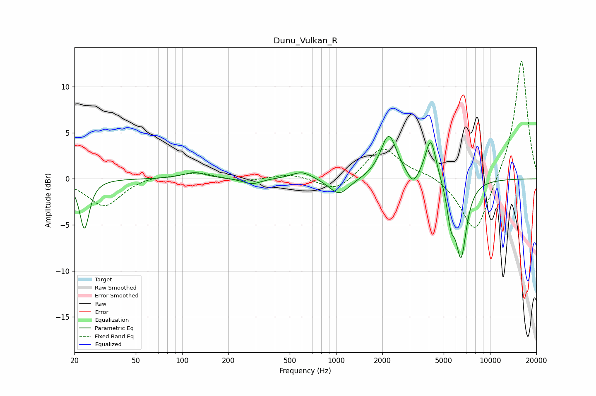

# Dunu_Vulkan_R
See [usage instructions](https://github.com/jaakkopasanen/AutoEq#usage) for more options and info.

### Parametric EQs
Apply preamp of -4.7 dB when using parametric equalizer.

|   # | Type    |   Fc (Hz) |    Q |   Gain (dB) |
|-----|---------|-----------|------|-------------|
|   1 | Peaking |        23 | 4.68 |        -5.4 |
|   2 | Peaking |       120 | 1.87 |         0.7 |
|   3 | Peaking |       285 | 2.46 |        -0.6 |
|   4 | Peaking |       602 | 2.04 |         0.9 |
|   5 | Peaking |      1049 | 2.15 |        -1.9 |
|   6 | Peaking |      2199 | 2.73 |         4.8 |
|   7 | Peaking |      3165 | 4.03 |        -1.4 |
|   8 | Peaking |      4117 | 3.98 |         4.6 |
|   9 | Peaking |      5565 | 5.83 |        -3.2 |
|  10 | Peaking |      6478 | 3.75 |        -8.2 |

### Fixed Band EQs
When using fixed band (also called graphic) equalizer, apply preamp of **-12.9 dB** (if available) and set gains manually with these parameters.

|   # | Type    |   Fc (Hz) |    Q |   Gain (dB) |
|-----|---------|-----------|------|-------------|
|   1 | Peaking |        31 | 1.41 |        -3   |
|   2 | Peaking |        62 | 1.41 |         0.4 |
|   3 | Peaking |       125 | 1.41 |         0.7 |
|   4 | Peaking |       250 | 1.41 |        -0.3 |
|   5 | Peaking |       500 | 1.41 |         0.6 |
|   6 | Peaking |      1000 | 1.41 |        -1.5 |
|   7 | Peaking |      2000 | 1.41 |         3.5 |
|   8 | Peaking |      4000 | 1.41 |         0.5 |
|   9 | Peaking |      8000 | 1.41 |        -6.3 |
|  10 | Peaking |     16000 | 1.41 |        13.2 |

### Graphs

