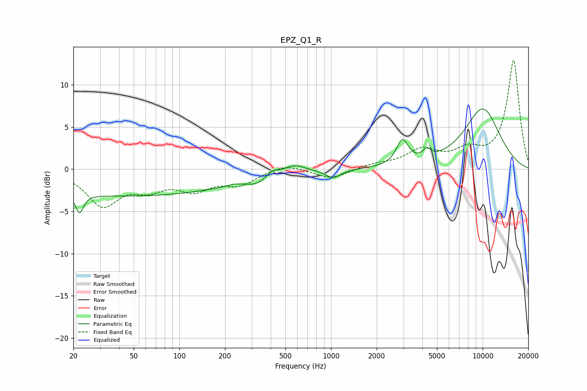

# EPZ_Q1_R
See [usage instructions](https://github.com/jaakkopasanen/AutoEq#usage) for more options and info.

### Parametric EQs
Apply preamp of -7.2 dB when using parametric equalizer.

|   # | Type    |   Fc (Hz) |    Q |   Gain (dB) |
|-----|---------|-----------|------|-------------|
|   1 | Peaking |        22 | 5.61 |        -2.3 |
|   2 | Peaking |        46 | 0.18 |        -3.2 |
|   3 | Peaking |       228 | 5.99 |         0.1 |
|   4 | Peaking |       321 | 2.49 |        -0.7 |
|   5 | Peaking |       411 | 3.68 |         0.6 |
|   6 | Peaking |       572 | 1.99 |         0.9 |
|   7 | Peaking |      1029 | 2.79 |        -1   |
|   8 | Peaking |      2958 | 3.62 |         2.9 |
|   9 | Peaking |      4282 | 5.04 |         1   |
|  10 | Peaking |     10000 | 0.97 |         7.1 |

### Fixed Band EQs
When using fixed band (also called graphic) equalizer, apply preamp of **-13.0 dB** (if available) and set gains manually with these parameters.

|   # | Type    |   Fc (Hz) |    Q |   Gain (dB) |
|-----|---------|-----------|------|-------------|
|   1 | Peaking |        31 | 1.41 |        -4.1 |
|   2 | Peaking |        62 | 1.41 |        -1.9 |
|   3 | Peaking |       125 | 1.41 |        -2.1 |
|   4 | Peaking |       250 | 1.41 |        -1.7 |
|   5 | Peaking |       500 | 1.41 |         0.7 |
|   6 | Peaking |      1000 | 1.41 |        -1.2 |
|   7 | Peaking |      2000 | 1.41 |         0.5 |
|   8 | Peaking |      4000 | 1.41 |         2.1 |
|   9 | Peaking |      8000 | 1.41 |         1.8 |
|  10 | Peaking |     16000 | 1.41 |        12.9 |

### Graphs

