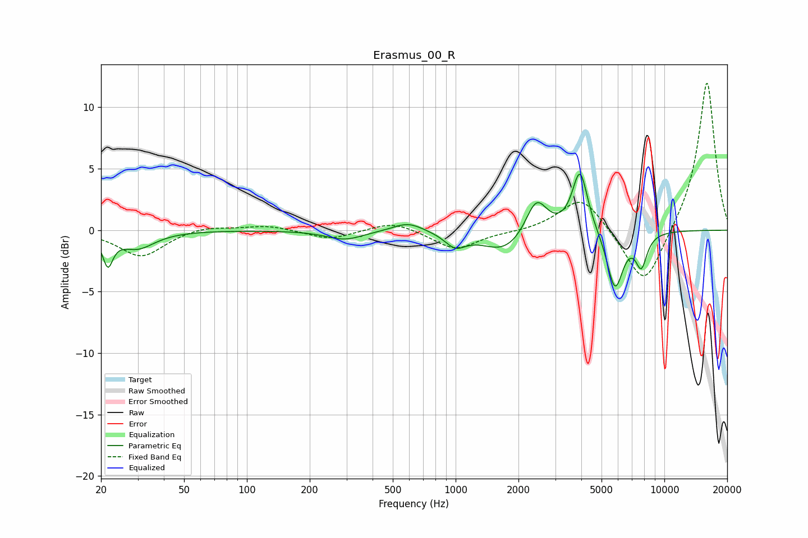

# Erasmus_00_R
See [usage instructions](https://github.com/jaakkopasanen/AutoEq#usage) for more options and info.

### Parametric EQs
Apply preamp of -4.6 dB when using parametric equalizer.

|   # | Type    |   Fc (Hz) |    Q |   Gain (dB) |
|-----|---------|-----------|------|-------------|
|   1 | Peaking |        22 | 5.99 |        -2.4 |
|   2 | Peaking |        30 | 1.7  |        -1.4 |
|   3 | Peaking |       294 | 1.6  |        -0.8 |
|   4 | Peaking |       593 | 1.91 |         0.8 |
|   5 | Peaking |       996 | 2.87 |        -1.1 |
|   6 | Peaking |      1724 | 1.3  |        -1.8 |
|   7 | Peaking |      2436 | 2.76 |         3   |
|   8 | Peaking |      3943 | 3.82 |         5   |
|   9 | Peaking |      5802 | 3.55 |        -4.8 |
|  10 | Peaking |      7755 | 4.87 |        -2.6 |

### Fixed Band EQs
When using fixed band (also called graphic) equalizer, apply preamp of **-12.1 dB** (if available) and set gains manually with these parameters.

|   # | Type    |   Fc (Hz) |    Q |   Gain (dB) |
|-----|---------|-----------|------|-------------|
|   1 | Peaking |        31 | 1.41 |        -2.2 |
|   2 | Peaking |        62 | 1.41 |         0.4 |
|   3 | Peaking |       125 | 1.41 |         0.4 |
|   4 | Peaking |       250 | 1.41 |        -0.8 |
|   5 | Peaking |       500 | 1.41 |         0.8 |
|   6 | Peaking |      1000 | 1.41 |        -1.6 |
|   7 | Peaking |      2000 | 1.41 |        -0.1 |
|   8 | Peaking |      4000 | 1.41 |         2.9 |
|   9 | Peaking |      8000 | 1.41 |        -4.9 |
|  10 | Peaking |     16000 | 1.41 |        12.3 |

### Graphs

