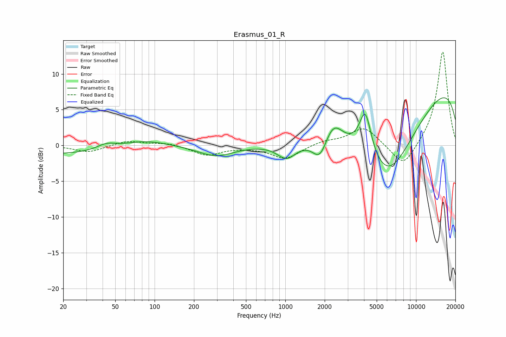

# Erasmus_01_R
See [usage instructions](https://github.com/jaakkopasanen/AutoEq#usage) for more options and info.

### Parametric EQs
Apply preamp of -6.8 dB when using parametric equalizer.

|   # | Type    |   Fc (Hz) |    Q |   Gain (dB) |
|-----|---------|-----------|------|-------------|
|   1 | Peaking |        20 | 0.26 |        -1.3 |
|   2 | Peaking |        43 | 1.91 |         0.8 |
|   3 | Peaking |        82 | 0.78 |         1.2 |
|   4 | Peaking |       295 | 1.04 |        -1.5 |
|   5 | Peaking |      1024 | 1.9  |        -2.2 |
|   6 | Peaking |      1843 | 2.49 |        -3.2 |
|   7 | Peaking |      2321 | 2    |         3.1 |
|   8 | Peaking |      4091 | 3    |         6.3 |
|   9 | Peaking |      6055 | 0.52 |       -13.9 |
|  10 | Peaking |     10000 | 0.18 |        10.9 |

### Fixed Band EQs
When using fixed band (also called graphic) equalizer, apply preamp of **-13.2 dB** (if available) and set gains manually with these parameters.

|   # | Type    |   Fc (Hz) |    Q |   Gain (dB) |
|-----|---------|-----------|------|-------------|
|   1 | Peaking |        31 | 1.41 |        -1   |
|   2 | Peaking |        62 | 1.41 |         0.7 |
|   3 | Peaking |       125 | 1.41 |         0.4 |
|   4 | Peaking |       250 | 1.41 |        -1.4 |
|   5 | Peaking |       500 | 1.41 |        -0.1 |
|   6 | Peaking |      1000 | 1.41 |        -1.9 |
|   7 | Peaking |      2000 | 1.41 |         0.6 |
|   8 | Peaking |      4000 | 1.41 |         2.6 |
|   9 | Peaking |      8000 | 1.41 |        -3.4 |
|  10 | Peaking |     16000 | 1.41 |        13.3 |

### Graphs

