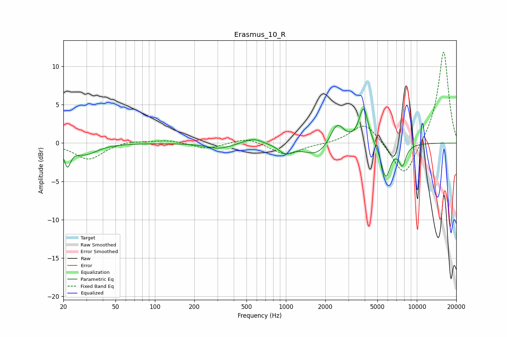

# Erasmus_10_R
See [usage instructions](https://github.com/jaakkopasanen/AutoEq#usage) for more options and info.

### Parametric EQs
Apply preamp of -4.6 dB when using parametric equalizer.

|   # | Type    |   Fc (Hz) |    Q |   Gain (dB) |
|-----|---------|-----------|------|-------------|
|   1 | Peaking |        21 | 5.95 |        -2.5 |
|   2 | Peaking |        29 | 1.58 |        -1.4 |
|   3 | Peaking |       309 | 1.52 |        -0.7 |
|   4 | Peaking |       563 | 1.97 |         0.8 |
|   5 | Peaking |       987 | 2.84 |        -1.1 |
|   6 | Peaking |      1728 | 1.37 |        -1.7 |
|   7 | Peaking |      2459 | 2.66 |         3   |
|   8 | Peaking |      3922 | 4.08 |         4.8 |
|   9 | Peaking |      5787 | 3.81 |        -4.5 |
|  10 | Peaking |      7756 | 4.79 |        -2.5 |

### Fixed Band EQs
When using fixed band (also called graphic) equalizer, apply preamp of **-12.0 dB** (if available) and set gains manually with these parameters.

|   # | Type    |   Fc (Hz) |    Q |   Gain (dB) |
|-----|---------|-----------|------|-------------|
|   1 | Peaking |        31 | 1.41 |        -2.2 |
|   2 | Peaking |        62 | 1.41 |         0.4 |
|   3 | Peaking |       125 | 1.41 |         0.4 |
|   4 | Peaking |       250 | 1.41 |        -0.8 |
|   5 | Peaking |       500 | 1.41 |         0.8 |
|   6 | Peaking |      1000 | 1.41 |        -1.6 |
|   7 | Peaking |      2000 | 1.41 |        -0.1 |
|   8 | Peaking |      4000 | 1.41 |         2.8 |
|   9 | Peaking |      8000 | 1.41 |        -4.8 |
|  10 | Peaking |     16000 | 1.41 |        12.2 |

### Graphs

