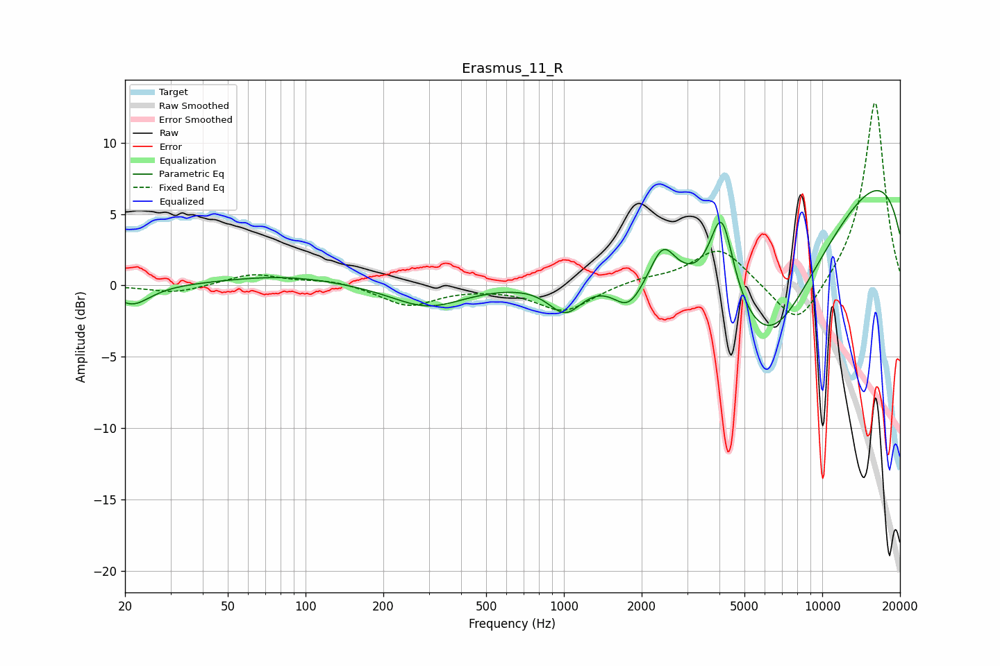

# Erasmus_11_R
See [usage instructions](https://github.com/jaakkopasanen/AutoEq#usage) for more options and info.

### Parametric EQs
Apply preamp of -6.7 dB when using parametric equalizer.

|   # | Type    |   Fc (Hz) |    Q |   Gain (dB) |
|-----|---------|-----------|------|-------------|
|   1 | Peaking |        20 | 2.09 |         0   |
|   2 | Peaking |        21 | 2.07 |        -1.4 |
|   3 | Peaking |        83 | 0.61 |         0.7 |
|   4 | Peaking |       296 | 1.01 |        -1.6 |
|   5 | Peaking |      1014 | 2.11 |        -2.3 |
|   6 | Peaking |      1780 | 2.33 |        -2.3 |
|   7 | Peaking |      2419 | 3    |         2.5 |
|   8 | Peaking |      4082 | 3.04 |         6.3 |
|   9 | Peaking |      6140 | 0.53 |       -13.7 |
|  10 | Peaking |     10000 | 0.18 |        10.9 |

### Fixed Band EQs
When using fixed band (also called graphic) equalizer, apply preamp of **-12.9 dB** (if available) and set gains manually with these parameters.

|   # | Type    |   Fc (Hz) |    Q |   Gain (dB) |
|-----|---------|-----------|------|-------------|
|   1 | Peaking |        31 | 1.41 |        -0.5 |
|   2 | Peaking |        62 | 1.41 |         0.8 |
|   3 | Peaking |       125 | 1.41 |         0.4 |
|   4 | Peaking |       250 | 1.41 |        -1.4 |
|   5 | Peaking |       500 | 1.41 |        -0.1 |
|   6 | Peaking |      1000 | 1.41 |        -1.8 |
|   7 | Peaking |      2000 | 1.41 |         0.4 |
|   8 | Peaking |      4000 | 1.41 |         2.7 |
|   9 | Peaking |      8000 | 1.41 |        -3.3 |
|  10 | Peaking |     16000 | 1.41 |        13   |

### Graphs

