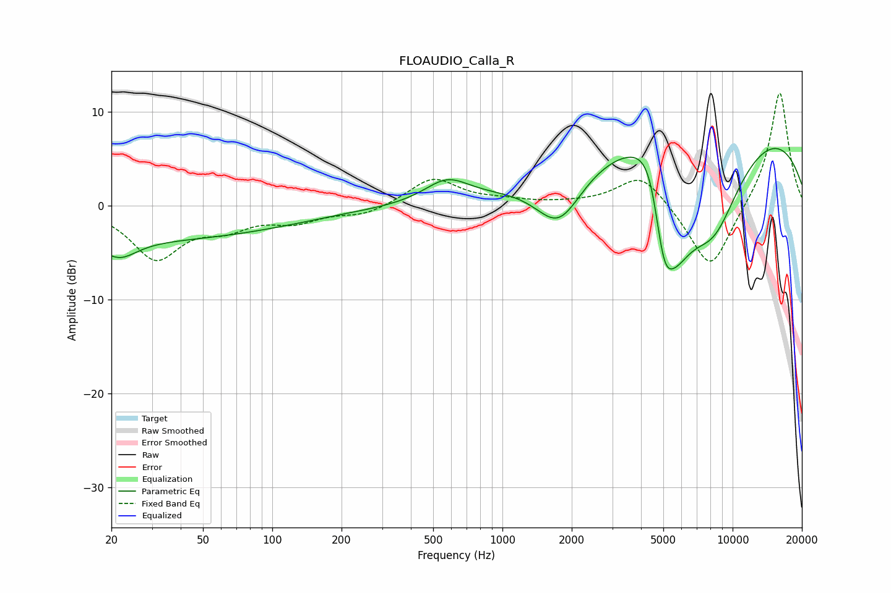

# FLOAUDIO_Calla_R
See [usage instructions](https://github.com/jaakkopasanen/AutoEq#usage) for more options and info.

### Parametric EQs
Apply preamp of -6.2 dB when using parametric equalizer.

|   # | Type    |   Fc (Hz) |    Q |   Gain (dB) |
|-----|---------|-----------|------|-------------|
|   1 | Peaking |        22 | 1.89 |        -2   |
|   2 | Peaking |        25 | 0.19 |        -3.6 |
|   3 | Peaking |       574 | 1.44 |         2.5 |
|   4 | Peaking |      1759 | 1.33 |        -6.1 |
|   5 | Peaking |      2632 | 0.2  |        -0.9 |
|   6 | Peaking |      4528 | 1.55 |        12   |
|   7 | Peaking |      4983 | 2.3  |       -11.9 |
|   8 | Peaking |      5574 | 1.28 |        -9.5 |
|   9 | Peaking |      7749 | 0.18 |        10.7 |
|  10 | Peaking |      8245 | 0.93 |       -10   |

### Fixed Band EQs
When using fixed band (also called graphic) equalizer, apply preamp of **-12.1 dB** (if available) and set gains manually with these parameters.

|   # | Type    |   Fc (Hz) |    Q |   Gain (dB) |
|-----|---------|-----------|------|-------------|
|   1 | Peaking |        31 | 1.41 |        -5.4 |
|   2 | Peaking |        62 | 1.41 |        -1.9 |
|   3 | Peaking |       125 | 1.41 |        -1.5 |
|   4 | Peaking |       250 | 1.41 |        -1   |
|   5 | Peaking |       500 | 1.41 |         3   |
|   6 | Peaking |      1000 | 1.41 |         0.4 |
|   7 | Peaking |      2000 | 1.41 |         0.1 |
|   8 | Peaking |      4000 | 1.41 |         3.5 |
|   9 | Peaking |      8000 | 1.41 |        -7.2 |
|  10 | Peaking |     16000 | 1.41 |        12.4 |

### Graphs

