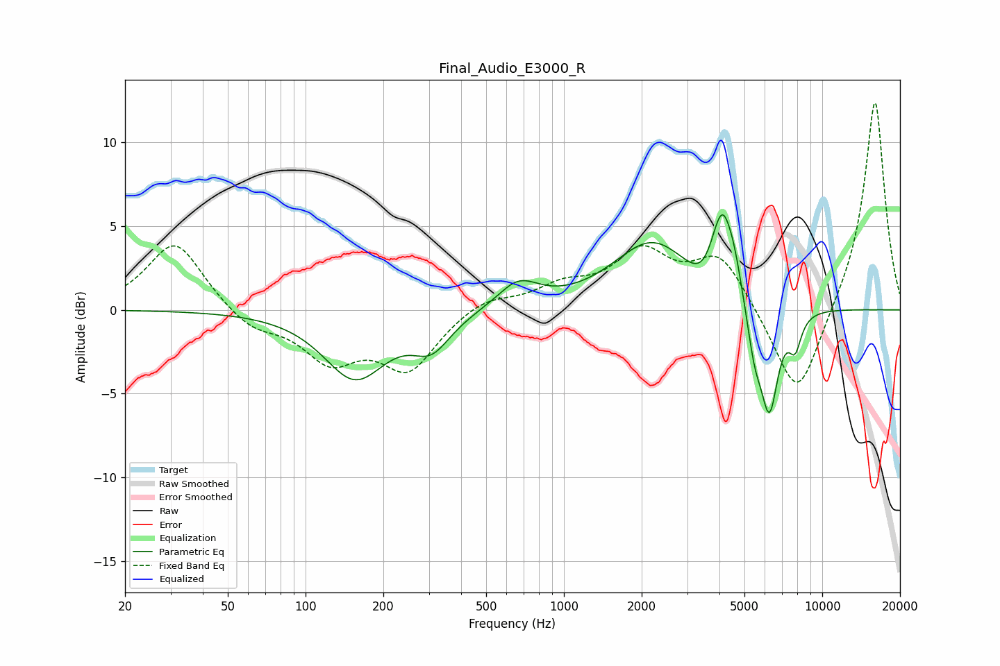

# Final_Audio_E3000_R
See [usage instructions](https://github.com/jaakkopasanen/AutoEq#usage) for more options and info.

### Parametric EQs
Apply preamp of -5.8 dB when using parametric equalizer.

|   # | Type    |   Fc (Hz) |    Q |   Gain (dB) |
|-----|---------|-----------|------|-------------|
|   1 | Peaking |       155 | 1.18 |        -4   |
|   2 | Peaking |       307 | 1.91 |        -1.9 |
|   3 | Peaking |       666 | 1.78 |         1.6 |
|   4 | Peaking |      2201 | 0.93 |         4   |
|   5 | Peaking |      3595 | 2.07 |        -1.9 |
|   6 | Peaking |      4103 | 2.89 |         6   |
|   7 | Peaking |      4591 | 6    |         0.7 |
|   8 | Peaking |      5466 | 4.65 |        -2.6 |
|   9 | Peaking |      6244 | 3.95 |        -6.2 |
|  10 | Peaking |      7850 | 5.45 |        -1.9 |

### Fixed Band EQs
When using fixed band (also called graphic) equalizer, apply preamp of **-12.4 dB** (if available) and set gains manually with these parameters.

|   # | Type    |   Fc (Hz) |    Q |   Gain (dB) |
|-----|---------|-----------|------|-------------|
|   1 | Peaking |        31 | 1.41 |         4.1 |
|   2 | Peaking |        62 | 1.41 |        -1.2 |
|   3 | Peaking |       125 | 1.41 |        -2.8 |
|   4 | Peaking |       250 | 1.41 |        -3.4 |
|   5 | Peaking |       500 | 1.41 |         0.8 |
|   6 | Peaking |      1000 | 1.41 |         1.2 |
|   7 | Peaking |      2000 | 1.41 |         3.2 |
|   8 | Peaking |      4000 | 1.41 |         3.2 |
|   9 | Peaking |      8000 | 1.41 |        -5.7 |
|  10 | Peaking |     16000 | 1.41 |        12.7 |

### Graphs

