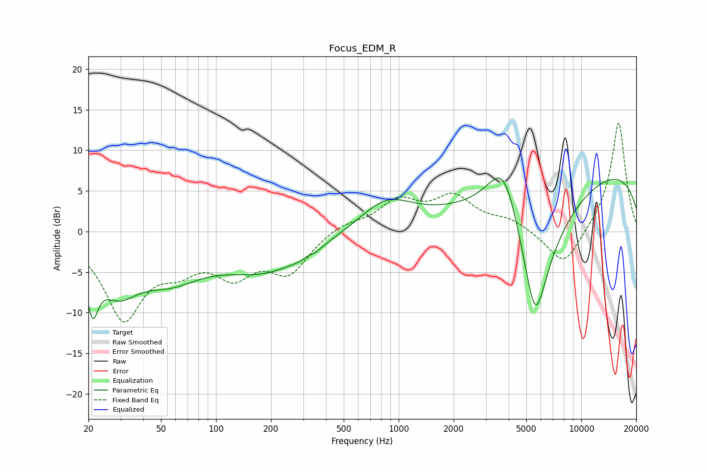

# Focus_EDM_R
See [usage instructions](https://github.com/jaakkopasanen/AutoEq#usage) for more options and info.

### Parametric EQs
Apply preamp of -6.7 dB when using parametric equalizer.

|   # | Type    |   Fc (Hz) |    Q |   Gain (dB) |
|-----|---------|-----------|------|-------------|
|   1 | Peaking |        21 | 4.59 |        -6   |
|   2 | Peaking |        29 | 1.25 |        -5.5 |
|   3 | Peaking |        56 | 0.77 |        -4.5 |
|   4 | Peaking |       187 | 0.59 |        -4.5 |
|   5 | Peaking |       317 | 4.02 |         4.3 |
|   6 | Peaking |       317 | 3.59 |        -4.6 |
|   7 | Peaking |       852 | 0.99 |         3.6 |
|   8 | Peaking |      3766 | 1.49 |         8.6 |
|   9 | Peaking |      5593 | 1.27 |       -20   |
|  10 | Peaking |     10000 | 0.18 |         8.4 |

### Fixed Band EQs
When using fixed band (also called graphic) equalizer, apply preamp of **-13.4 dB** (if available) and set gains manually with these parameters.

|   # | Type    |   Fc (Hz) |    Q |   Gain (dB) |
|-----|---------|-----------|------|-------------|
|   1 | Peaking |        31 | 1.41 |       -10.4 |
|   2 | Peaking |        62 | 1.41 |        -3.1 |
|   3 | Peaking |       125 | 1.41 |        -4.5 |
|   4 | Peaking |       250 | 1.41 |        -4.7 |
|   5 | Peaking |       500 | 1.41 |         1   |
|   6 | Peaking |      1000 | 1.41 |         3.5 |
|   7 | Peaking |      2000 | 1.41 |         3.9 |
|   8 | Peaking |      4000 | 1.41 |         1.3 |
|   9 | Peaking |      8000 | 1.41 |        -4.6 |
|  10 | Peaking |     16000 | 1.41 |        13.6 |

### Graphs

