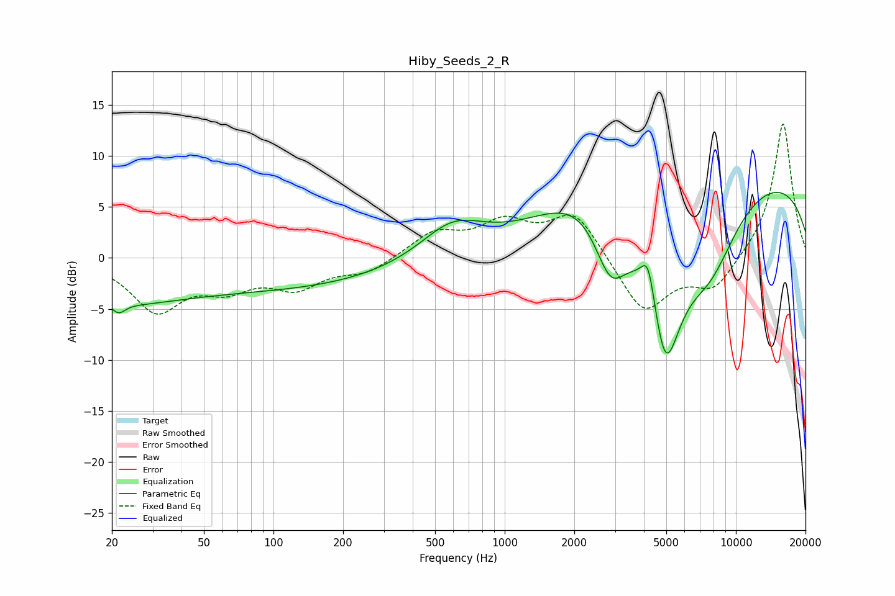

# Hiby_Seeds_2_R
See [usage instructions](https://github.com/jaakkopasanen/AutoEq#usage) for more options and info.

### Parametric EQs
Apply preamp of -6.5 dB when using parametric equalizer.

|   # | Type    |   Fc (Hz) |    Q |   Gain (dB) |
|-----|---------|-----------|------|-------------|
|   1 | Peaking |        20 | 0.61 |        -2.4 |
|   2 | Peaking |        21 | 5.2  |        -1   |
|   3 | Peaking |        79 | 0.21 |        -3.1 |
|   4 | Peaking |       594 | 1.02 |         3.4 |
|   5 | Peaking |      2476 | 0.71 |         4.3 |
|   6 | Peaking |      2869 | 1.79 |        -7.5 |
|   7 | Peaking |      4179 | 4.54 |         4.2 |
|   8 | Peaking |      4952 | 1.62 |       -15.6 |
|   9 | Peaking |      7706 | 1.03 |        -6.8 |
|  10 | Peaking |      9292 | 0.18 |         8.7 |

### Fixed Band EQs
When using fixed band (also called graphic) equalizer, apply preamp of **-13.2 dB** (if available) and set gains manually with these parameters.

|   # | Type    |   Fc (Hz) |    Q |   Gain (dB) |
|-----|---------|-----------|------|-------------|
|   1 | Peaking |        31 | 1.41 |        -5   |
|   2 | Peaking |        62 | 1.41 |        -2.4 |
|   3 | Peaking |       125 | 1.41 |        -2.6 |
|   4 | Peaking |       250 | 1.41 |        -1.4 |
|   5 | Peaking |       500 | 1.41 |         2.4 |
|   6 | Peaking |      1000 | 1.41 |         3.1 |
|   7 | Peaking |      2000 | 1.41 |         4.5 |
|   8 | Peaking |      4000 | 1.41 |        -5.5 |
|   9 | Peaking |      8000 | 1.41 |        -3.1 |
|  10 | Peaking |     16000 | 1.41 |        13.4 |

### Graphs

