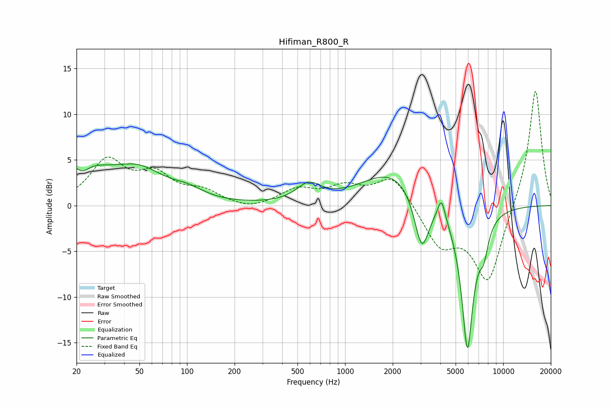

# Hifiman_R800_R
See [usage instructions](https://github.com/jaakkopasanen/AutoEq#usage) for more options and info.

### Parametric EQs
Apply preamp of -4.7 dB when using parametric equalizer.

|   # | Type    |   Fc (Hz) |    Q |   Gain (dB) |
|-----|---------|-----------|------|-------------|
|   1 | Peaking |        20 | 0.92 |         4.6 |
|   2 | Peaking |        22 | 2.77 |        -1.7 |
|   3 | Peaking |        49 | 0.83 |         3.4 |
|   4 | Peaking |       102 | 1.41 |         0.9 |
|   5 | Peaking |       587 | 1.88 |         1.9 |
|   6 | Peaking |      2044 | 0.7  |         3.9 |
|   7 | Peaking |      3055 | 2.98 |        -6.3 |
|   8 | Peaking |      4068 | 6    |         2.4 |
|   9 | Peaking |      5938 | 3.42 |       -15.9 |
|  10 | Peaking |      7537 | 4.65 |        -2.7 |

### Fixed Band EQs
When using fixed band (also called graphic) equalizer, apply preamp of **-12.6 dB** (if available) and set gains manually with these parameters.

|   # | Type    |   Fc (Hz) |    Q |   Gain (dB) |
|-----|---------|-----------|------|-------------|
|   1 | Peaking |        31 | 1.41 |         4.7 |
|   2 | Peaking |        62 | 1.41 |         3   |
|   3 | Peaking |       125 | 1.41 |         1.4 |
|   4 | Peaking |       250 | 1.41 |        -0.6 |
|   5 | Peaking |       500 | 1.41 |         1.6 |
|   6 | Peaking |      1000 | 1.41 |         1.8 |
|   7 | Peaking |      2000 | 1.41 |         3.3 |
|   8 | Peaking |      4000 | 1.41 |        -4.2 |
|   9 | Peaking |      8000 | 1.41 |        -8.5 |
|  10 | Peaking |     16000 | 1.41 |        13.1 |

### Graphs

