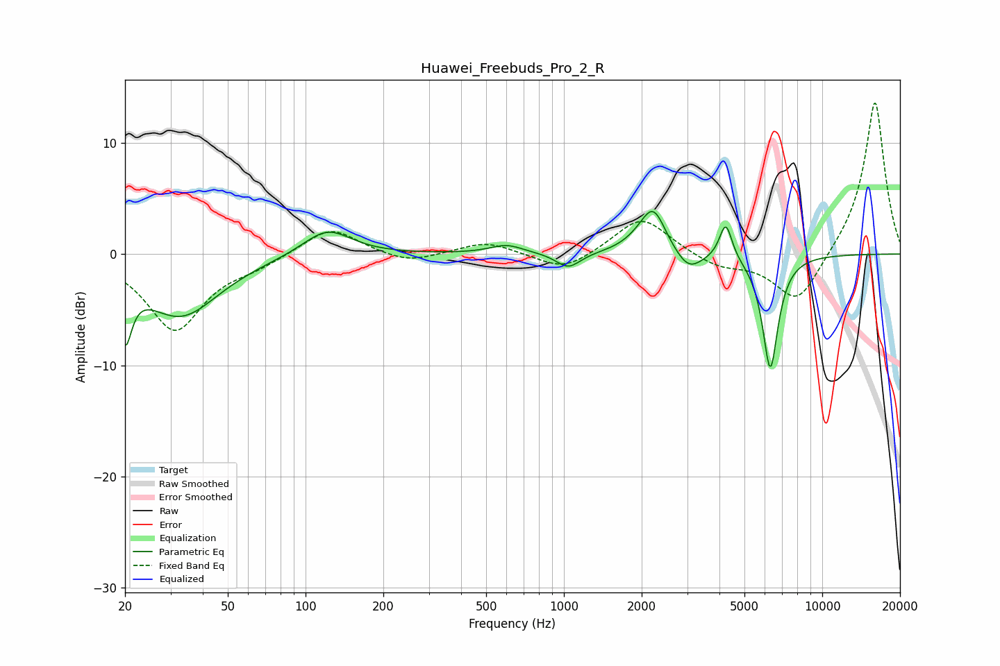

# Huawei_Freebuds_Pro_2_R
See [usage instructions](https://github.com/jaakkopasanen/AutoEq#usage) for more options and info.

### Parametric EQs
Apply preamp of -3.9 dB when using parametric equalizer.

|   # | Type    |   Fc (Hz) |    Q |   Gain (dB) |
|-----|---------|-----------|------|-------------|
|   1 | Peaking |        20 | 5.61 |        -5.5 |
|   2 | Peaking |        33 | 0.95 |        -5.5 |
|   3 | Peaking |       121 | 1.5  |         2.4 |
|   4 | Peaking |       600 | 2.2  |         0.8 |
|   5 | Peaking |      1040 | 3.02 |        -1.4 |
|   6 | Peaking |      1965 | 2.12 |         0.7 |
|   7 | Peaking |      2220 | 2.94 |         3.8 |
|   8 | Peaking |      3036 | 2.7  |        -1.8 |
|   9 | Peaking |      4233 | 5.82 |         3.3 |
|  10 | Peaking |      6294 | 4.46 |       -10.3 |

### Fixed Band EQs
When using fixed band (also called graphic) equalizer, apply preamp of **-13.7 dB** (if available) and set gains manually with these parameters.

|   # | Type    |   Fc (Hz) |    Q |   Gain (dB) |
|-----|---------|-----------|------|-------------|
|   1 | Peaking |        31 | 1.41 |        -6.8 |
|   2 | Peaking |        62 | 1.41 |        -0.8 |
|   3 | Peaking |       125 | 1.41 |         2.5 |
|   4 | Peaking |       250 | 1.41 |        -0.9 |
|   5 | Peaking |       500 | 1.41 |         1.1 |
|   6 | Peaking |      1000 | 1.41 |        -1.6 |
|   7 | Peaking |      2000 | 1.41 |         3.5 |
|   8 | Peaking |      4000 | 1.41 |        -1.1 |
|   9 | Peaking |      8000 | 1.41 |        -4.6 |
|  10 | Peaking |     16000 | 1.41 |        13.9 |

### Graphs

