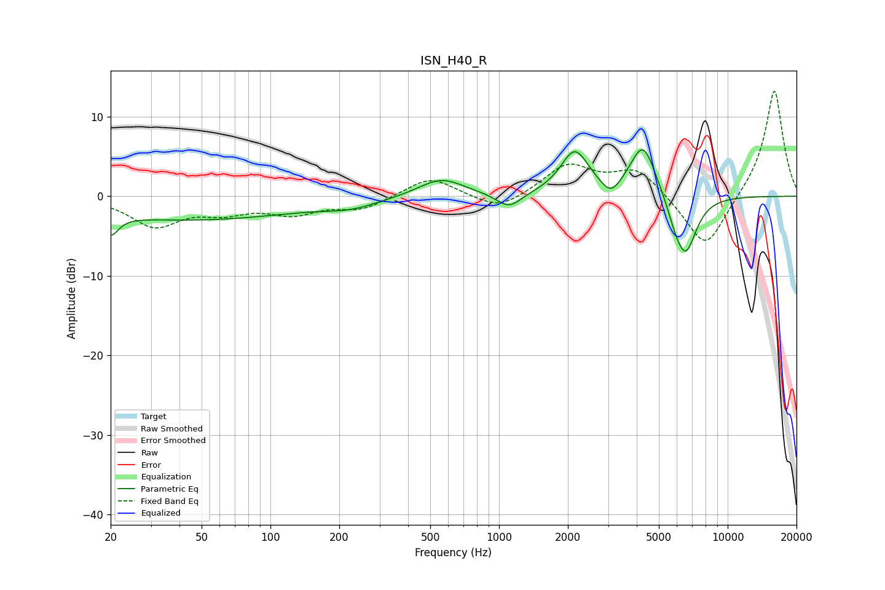

# ISN_H40_R
See [usage instructions](https://github.com/jaakkopasanen/AutoEq#usage) for more options and info.

### Parametric EQs
Apply preamp of -5.9 dB when using parametric equalizer.

|   # | Type    |   Fc (Hz) |    Q |   Gain (dB) |
|-----|---------|-----------|------|-------------|
|   1 | Peaking |        20 | 4.23 |        -2.5 |
|   2 | Peaking |        44 | 0.29 |        -2.9 |
|   3 | Peaking |       225 | 1.21 |        -0.9 |
|   4 | Peaking |       558 | 1.41 |         2.3 |
|   5 | Peaking |      1105 | 2.55 |        -2   |
|   6 | Peaking |      2144 | 2.28 |         5.5 |
|   7 | Peaking |      3089 | 3.42 |        -1.9 |
|   8 | Peaking |      4264 | 2.42 |         6.7 |
|   9 | Peaking |      5921 | 3.58 |        -2.1 |
|  10 | Peaking |      6577 | 2.86 |        -6.8 |

### Fixed Band EQs
When using fixed band (also called graphic) equalizer, apply preamp of **-13.3 dB** (if available) and set gains manually with these parameters.

|   # | Type    |   Fc (Hz) |    Q |   Gain (dB) |
|-----|---------|-----------|------|-------------|
|   1 | Peaking |        31 | 1.41 |        -3.6 |
|   2 | Peaking |        62 | 1.41 |        -1.6 |
|   3 | Peaking |       125 | 1.41 |        -1.9 |
|   4 | Peaking |       250 | 1.41 |        -1.6 |
|   5 | Peaking |       500 | 1.41 |         2.5 |
|   6 | Peaking |      1000 | 1.41 |        -2   |
|   7 | Peaking |      2000 | 1.41 |         3.9 |
|   8 | Peaking |      4000 | 1.41 |         3.4 |
|   9 | Peaking |      8000 | 1.41 |        -7   |
|  10 | Peaking |     16000 | 1.41 |        13.6 |

### Graphs

