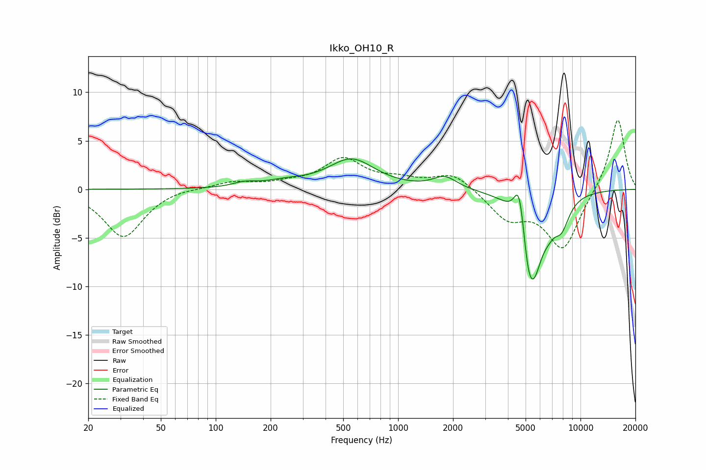

# Ikko_OH10_R
See [usage instructions](https://github.com/jaakkopasanen/AutoEq#usage) for more options and info.

### Parametric EQs
Apply preamp of -3.2 dB when using parametric equalizer.

|   # | Type    |   Fc (Hz) |    Q |   Gain (dB) |
|-----|---------|-----------|------|-------------|
|   1 | Peaking |       143 | 2.33 |         0.4 |
|   2 | Peaking |       241 | 1.2  |         0.6 |
|   3 | Peaking |       555 | 1.12 |         3   |
|   4 | Peaking |      1805 | 2.2  |         1.2 |
|   5 | Peaking |      4594 | 5.09 |         3.8 |
|   6 | Peaking |      4825 | 4.65 |         1   |
|   7 | Peaking |      5120 | 6    |        -1.7 |
|   8 | Peaking |      5455 | 2.48 |        -9   |
|   9 | Peaking |      6706 | 3.62 |        -1   |
|  10 | Peaking |      7876 | 3.08 |        -2.6 |

### Fixed Band EQs
When using fixed band (also called graphic) equalizer, apply preamp of **-7.2 dB** (if available) and set gains manually with these parameters.

|   # | Type    |   Fc (Hz) |    Q |   Gain (dB) |
|-----|---------|-----------|------|-------------|
|   1 | Peaking |        31 | 1.41 |        -4.9 |
|   2 | Peaking |        62 | 1.41 |         0.2 |
|   3 | Peaking |       125 | 1.41 |         0.7 |
|   4 | Peaking |       250 | 1.41 |         0.5 |
|   5 | Peaking |       500 | 1.41 |         3   |
|   6 | Peaking |      1000 | 1.41 |         0.8 |
|   7 | Peaking |      2000 | 1.41 |         1.7 |
|   8 | Peaking |      4000 | 1.41 |        -2.8 |
|   9 | Peaking |      8000 | 1.41 |        -6.1 |
|  10 | Peaking |     16000 | 1.41 |         7.5 |

### Graphs

