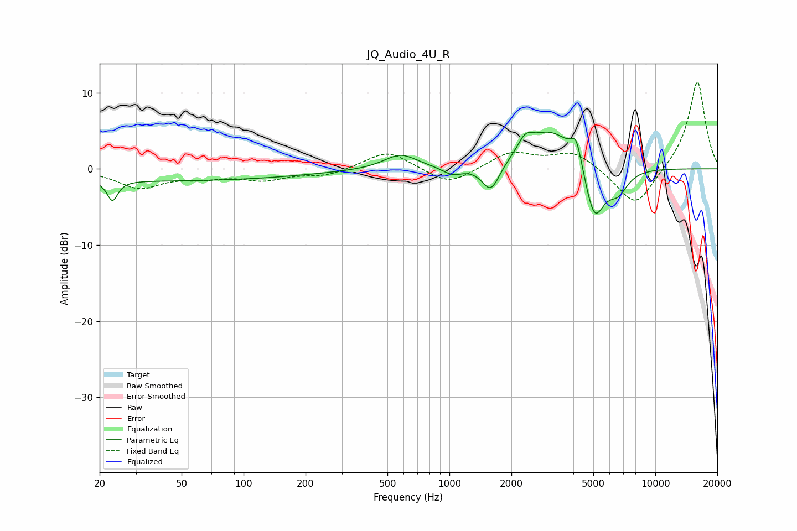

# JQ_Audio_4U_R
See [usage instructions](https://github.com/jaakkopasanen/AutoEq#usage) for more options and info.

### Parametric EQs
Apply preamp of -4.9 dB when using parametric equalizer.

|   # | Type    |   Fc (Hz) |    Q |   Gain (dB) |
|-----|---------|-----------|------|-------------|
|   1 | Peaking |        23 | 5.72 |        -2.7 |
|   2 | Peaking |        39 | 0.18 |        -1.6 |
|   3 | Peaking |       579 | 1.76 |         2   |
|   4 | Peaking |      1034 | 2.83 |        -1.1 |
|   5 | Peaking |      1590 | 3.17 |        -3.8 |
|   6 | Peaking |      2339 | 3.94 |         1.9 |
|   7 | Peaking |      3140 | 1.13 |         5.3 |
|   8 | Peaking |      4136 | 5.04 |         3.4 |
|   9 | Peaking |      5056 | 2.7  |        -7.8 |
|  10 | Peaking |      6590 | 2.83 |        -2.7 |

### Fixed Band EQs
When using fixed band (also called graphic) equalizer, apply preamp of **-11.5 dB** (if available) and set gains manually with these parameters.

|   # | Type    |   Fc (Hz) |    Q |   Gain (dB) |
|-----|---------|-----------|------|-------------|
|   1 | Peaking |        31 | 1.41 |        -2.4 |
|   2 | Peaking |        62 | 1.41 |        -0.9 |
|   3 | Peaking |       125 | 1.41 |        -1.3 |
|   4 | Peaking |       250 | 1.41 |        -0.9 |
|   5 | Peaking |       500 | 1.41 |         2.5 |
|   6 | Peaking |      1000 | 1.41 |        -2.2 |
|   7 | Peaking |      2000 | 1.41 |         2.2 |
|   8 | Peaking |      4000 | 1.41 |         2.3 |
|   9 | Peaking |      8000 | 1.41 |        -5.2 |
|  10 | Peaking |     16000 | 1.41 |        11.7 |

### Graphs

