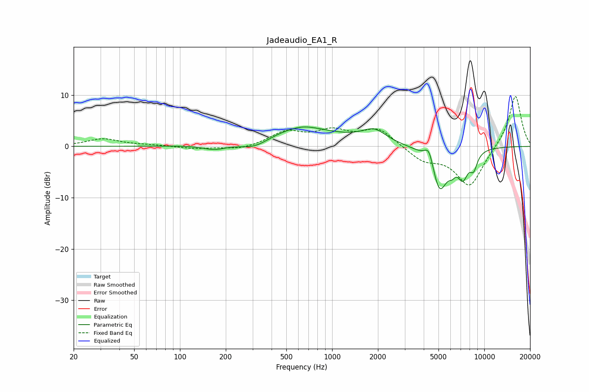

# Jadeaudio_EA1_R
See [usage instructions](https://github.com/jaakkopasanen/AutoEq#usage) for more options and info.

### Parametric EQs
Apply preamp of -3.9 dB when using parametric equalizer.

|   # | Type    |   Fc (Hz) |    Q |   Gain (dB) |
|-----|---------|-----------|------|-------------|
|   1 | Peaking |       169 | 1.76 |        -1.1 |
|   2 | Peaking |       310 | 1.34 |        -2.1 |
|   3 | Peaking |       589 | 0.5  |         3.5 |
|   4 | Peaking |       647 | 1.56 |         0.7 |
|   5 | Peaking |      1889 | 1.77 |         2.5 |
|   6 | Peaking |      4334 | 4.66 |         3.5 |
|   7 | Peaking |      5073 | 2.59 |        -8.7 |
|   8 | Peaking |      6136 | 5.89 |        -1.4 |
|   9 | Peaking |      7234 | 3.9  |        -4.6 |
|  10 | Peaking |      8512 | 5.37 |        -3   |

### Fixed Band EQs
When using fixed band (also called graphic) equalizer, apply preamp of **-9.8 dB** (if available) and set gains manually with these parameters.

|   # | Type    |   Fc (Hz) |    Q |   Gain (dB) |
|-----|---------|-----------|------|-------------|
|   1 | Peaking |        31 | 1.41 |         1.5 |
|   2 | Peaking |        62 | 1.41 |         0.2 |
|   3 | Peaking |       125 | 1.41 |        -0.5 |
|   4 | Peaking |       250 | 1.41 |        -0.7 |
|   5 | Peaking |       500 | 1.41 |         2.7 |
|   6 | Peaking |      1000 | 1.41 |         2.7 |
|   7 | Peaking |      2000 | 1.41 |         3.4 |
|   8 | Peaking |      4000 | 1.41 |        -2.6 |
|   9 | Peaking |      8000 | 1.41 |        -7.9 |
|  10 | Peaking |     16000 | 1.41 |        10.2 |

### Graphs

