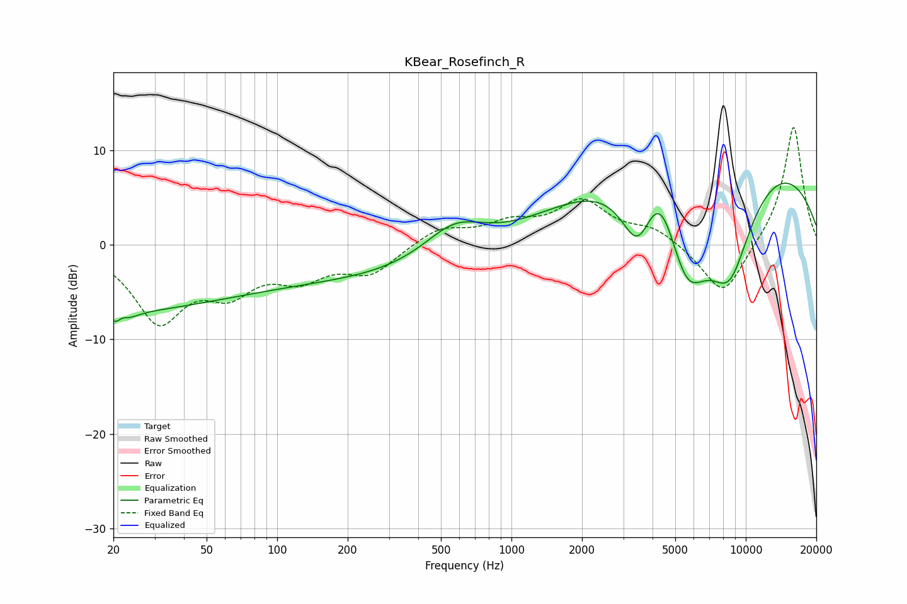

# KBear_Rosefinch_R
See [usage instructions](https://github.com/jaakkopasanen/AutoEq#usage) for more options and info.

### Parametric EQs
Apply preamp of -6.6 dB when using parametric equalizer.

|   # | Type    |   Fc (Hz) |    Q |   Gain (dB) |
|-----|---------|-----------|------|-------------|
|   1 | Peaking |        20 | 0.3  |        -6.4 |
|   2 | Peaking |        21 | 3.87 |        -4.1 |
|   3 | Peaking |        22 | 5.01 |         3   |
|   4 | Peaking |       307 | 0.19 |        -3.6 |
|   5 | Peaking |       572 | 1.04 |         3.9 |
|   6 | Peaking |      3468 | 2    |        -6.7 |
|   7 | Peaking |      4273 | 1.81 |         6.2 |
|   8 | Peaking |      5583 | 1.21 |       -12.3 |
|   9 | Peaking |      7027 | 0.19 |        12.2 |
|  10 | Peaking |      8528 | 1.18 |       -11.1 |

### Fixed Band EQs
When using fixed band (also called graphic) equalizer, apply preamp of **-12.5 dB** (if available) and set gains manually with these parameters.

|   # | Type    |   Fc (Hz) |    Q |   Gain (dB) |
|-----|---------|-----------|------|-------------|
|   1 | Peaking |        31 | 1.41 |        -7.7 |
|   2 | Peaking |        62 | 1.41 |        -4   |
|   3 | Peaking |       125 | 1.41 |        -2.9 |
|   4 | Peaking |       250 | 1.41 |        -2.8 |
|   5 | Peaking |       500 | 1.41 |         1.8 |
|   6 | Peaking |      1000 | 1.41 |         1.9 |
|   7 | Peaking |      2000 | 1.41 |         4.3 |
|   8 | Peaking |      4000 | 1.41 |         1.6 |
|   9 | Peaking |      8000 | 1.41 |        -5.7 |
|  10 | Peaking |     16000 | 1.41 |        12.8 |

### Graphs

