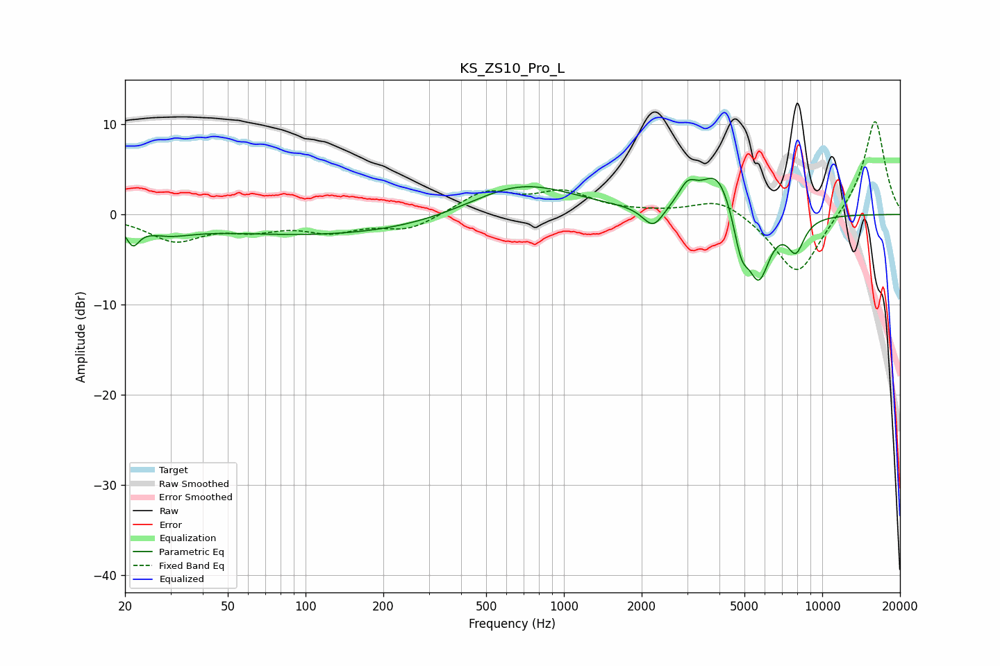

# KS_ZS10_Pro_L
See [usage instructions](https://github.com/jaakkopasanen/AutoEq#usage) for more options and info.

### Parametric EQs
Apply preamp of -4.1 dB when using parametric equalizer.

|   # | Type    |   Fc (Hz) |    Q |   Gain (dB) |
|-----|---------|-----------|------|-------------|
|   1 | Peaking |        21 | 5.88 |        -2.1 |
|   2 | Peaking |        29 | 1.47 |        -1.2 |
|   3 | Peaking |       178 | 0.19 |        -2.6 |
|   4 | Peaking |       672 | 0.63 |         4.8 |
|   5 | Peaking |      2216 | 3.52 |        -2.4 |
|   6 | Peaking |      3012 | 3.92 |         2.3 |
|   7 | Peaking |      3937 | 2.15 |         5.1 |
|   8 | Peaking |      4856 | 4.6  |        -4.3 |
|   9 | Peaking |      5682 | 3.12 |        -7.2 |
|  10 | Peaking |      7907 | 3.98 |        -3.5 |

### Fixed Band EQs
When using fixed band (also called graphic) equalizer, apply preamp of **-10.4 dB** (if available) and set gains manually with these parameters.

|   # | Type    |   Fc (Hz) |    Q |   Gain (dB) |
|-----|---------|-----------|------|-------------|
|   1 | Peaking |        31 | 1.41 |        -2.8 |
|   2 | Peaking |        62 | 1.41 |        -1.3 |
|   3 | Peaking |       125 | 1.41 |        -1.6 |
|   4 | Peaking |       250 | 1.41 |        -1.7 |
|   5 | Peaking |       500 | 1.41 |         2.5 |
|   6 | Peaking |      1000 | 1.41 |         2.3 |
|   7 | Peaking |      2000 | 1.41 |         0.1 |
|   8 | Peaking |      4000 | 1.41 |         1.9 |
|   9 | Peaking |      8000 | 1.41 |        -7.1 |
|  10 | Peaking |     16000 | 1.41 |        10.7 |

### Graphs

