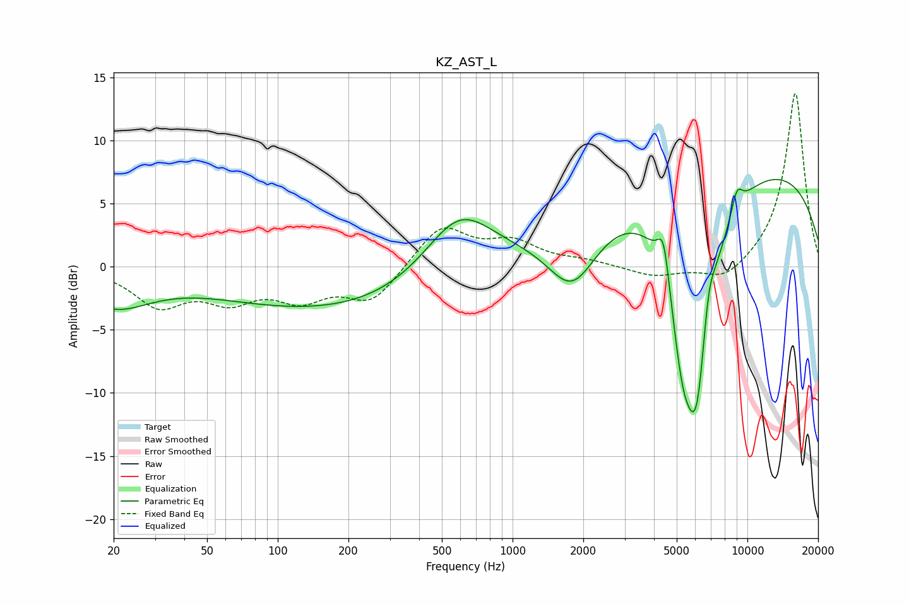

# KZ_AST_L
See [usage instructions](https://github.com/jaakkopasanen/AutoEq#usage) for more options and info.

### Parametric EQs
Apply preamp of -7.0 dB when using parametric equalizer.

|   # | Type    |   Fc (Hz) |    Q |   Gain (dB) |
|-----|---------|-----------|------|-------------|
|   1 | Peaking |        20 | 0.89 |        -2.8 |
|   2 | Peaking |       202 | 0.24 |        -3.6 |
|   3 | Peaking |       591 | 0.91 |         5.7 |
|   4 | Peaking |      1800 | 1.3  |        -5.2 |
|   5 | Peaking |      4396 | 5.52 |         3.5 |
|   6 | Peaking |      5297 | 2.63 |        -7.3 |
|   7 | Peaking |      6095 | 1.99 |       -16.2 |
|   8 | Peaking |      6813 | 4.75 |         3.3 |
|   9 | Peaking |      8345 | 0.18 |         8.6 |
|  10 | Peaking |      9025 | 5.16 |         1.8 |

### Fixed Band EQs
When using fixed band (also called graphic) equalizer, apply preamp of **-13.8 dB** (if available) and set gains manually with these parameters.

|   # | Type    |   Fc (Hz) |    Q |   Gain (dB) |
|-----|---------|-----------|------|-------------|
|   1 | Peaking |        31 | 1.41 |        -2.9 |
|   2 | Peaking |        62 | 1.41 |        -2.3 |
|   3 | Peaking |       125 | 1.41 |        -2.2 |
|   4 | Peaking |       250 | 1.41 |        -2.7 |
|   5 | Peaking |       500 | 1.41 |         3.3 |
|   6 | Peaking |      1000 | 1.41 |         1.8 |
|   7 | Peaking |      2000 | 1.41 |         0.4 |
|   8 | Peaking |      4000 | 1.41 |        -0.8 |
|   9 | Peaking |      8000 | 1.41 |        -1.4 |
|  10 | Peaking |     16000 | 1.41 |        13.9 |

### Graphs

