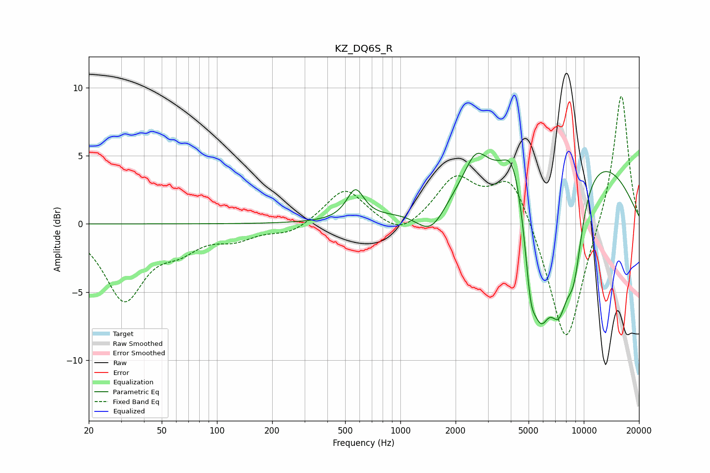

# KZ_DQ6S_R
See [usage instructions](https://github.com/jaakkopasanen/AutoEq#usage) for more options and info.

### Parametric EQs
Apply preamp of -5.3 dB when using parametric equalizer.

|   # | Type    |   Fc (Hz) |    Q |   Gain (dB) |
|-----|---------|-----------|------|-------------|
|   1 | Peaking |       569 | 3.04 |         2.2 |
|   2 | Peaking |      1475 | 1.65 |        -2.5 |
|   3 | Peaking |      2577 | 2.5  |         1.9 |
|   4 | Peaking |      4099 | 2.81 |         2.3 |
|   5 | Peaking |      5118 | 4.69 |        -4.1 |
|   6 | Peaking |      5814 | 2.12 |        -9.1 |
|   7 | Peaking |      7093 | 0.26 |         6.6 |
|   8 | Peaking |      7202 | 2.12 |         0.1 |
|   9 | Peaking |      7302 | 2.26 |        -7.2 |
|  10 | Peaking |      8847 | 2.55 |        -5.9 |

### Fixed Band EQs
When using fixed band (also called graphic) equalizer, apply preamp of **-9.5 dB** (if available) and set gains manually with these parameters.

|   # | Type    |   Fc (Hz) |    Q |   Gain (dB) |
|-----|---------|-----------|------|-------------|
|   1 | Peaking |        31 | 1.41 |        -5.4 |
|   2 | Peaking |        62 | 1.41 |        -1.4 |
|   3 | Peaking |       125 | 1.41 |        -0.9 |
|   4 | Peaking |       250 | 1.41 |        -0.7 |
|   5 | Peaking |       500 | 1.41 |         2.7 |
|   6 | Peaking |      1000 | 1.41 |        -1.2 |
|   7 | Peaking |      2000 | 1.41 |         3.2 |
|   8 | Peaking |      4000 | 1.41 |         3.8 |
|   9 | Peaking |      8000 | 1.41 |        -9.4 |
|  10 | Peaking |     16000 | 1.41 |         9.9 |

### Graphs

