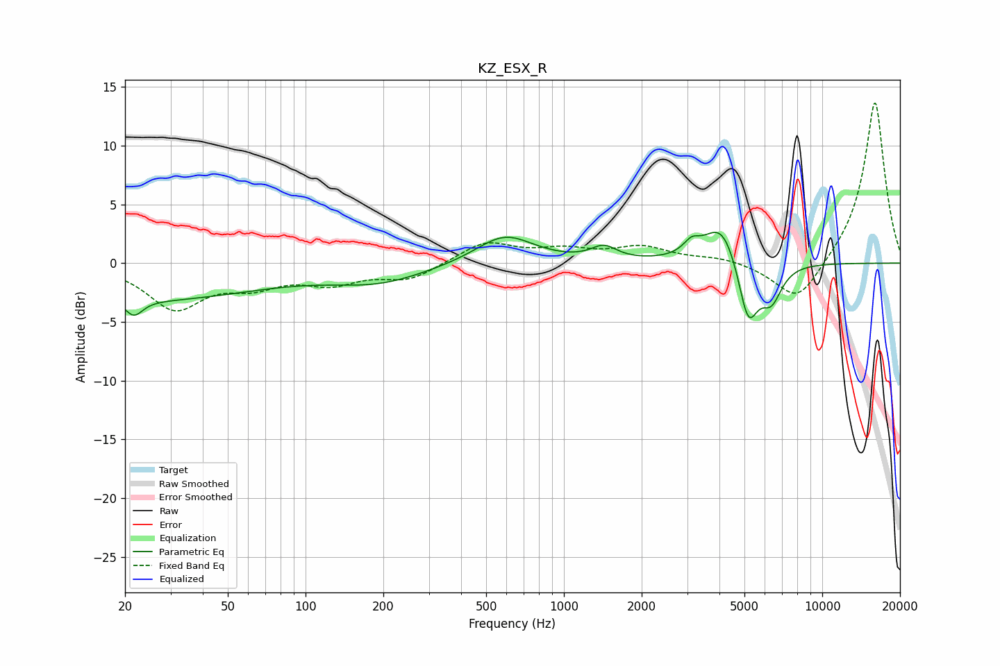

# KZ_ESX_R
See [usage instructions](https://github.com/jaakkopasanen/AutoEq#usage) for more options and info.

### Parametric EQs
Apply preamp of -2.7 dB when using parametric equalizer.

|   # | Type    |   Fc (Hz) |    Q |   Gain (dB) |
|-----|---------|-----------|------|-------------|
|   1 | Peaking |        22 | 5.21 |        -2.8 |
|   2 | Peaking |        22 | 5.99 |         1.5 |
|   3 | Peaking |        23 | 0.29 |        -3.1 |
|   4 | Peaking |       191 | 0.75 |        -1.5 |
|   5 | Peaking |       590 | 1.25 |         2.5 |
|   6 | Peaking |      1429 | 2.84 |         1.1 |
|   7 | Peaking |      3119 | 4.49 |         1   |
|   8 | Peaking |      4092 | 2.02 |         3.7 |
|   9 | Peaking |      5167 | 3.54 |        -5.5 |
|  10 | Peaking |      6351 | 3.32 |        -2.9 |

### Fixed Band EQs
When using fixed band (also called graphic) equalizer, apply preamp of **-13.7 dB** (if available) and set gains manually with these parameters.

|   # | Type    |   Fc (Hz) |    Q |   Gain (dB) |
|-----|---------|-----------|------|-------------|
|   1 | Peaking |        31 | 1.41 |        -3.7 |
|   2 | Peaking |        62 | 1.41 |        -1.6 |
|   3 | Peaking |       125 | 1.41 |        -1.5 |
|   4 | Peaking |       250 | 1.41 |        -1.3 |
|   5 | Peaking |       500 | 1.41 |         1.8 |
|   6 | Peaking |      1000 | 1.41 |         1   |
|   7 | Peaking |      2000 | 1.41 |         1.3 |
|   8 | Peaking |      4000 | 1.41 |         0.4 |
|   9 | Peaking |      8000 | 1.41 |        -3.6 |
|  10 | Peaking |     16000 | 1.41 |        13.9 |

### Graphs

