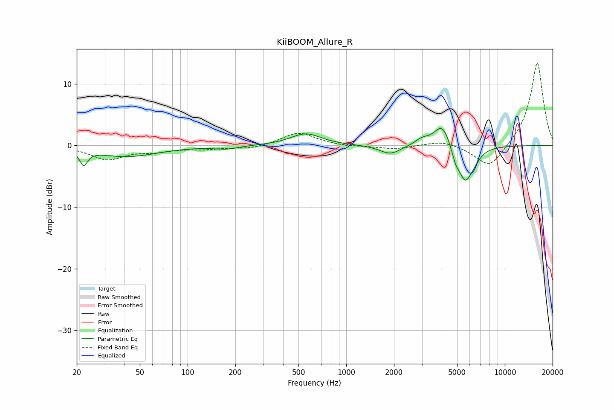

# KiiBOOM_Allure_R
See [usage instructions](https://github.com/jaakkopasanen/AutoEq#usage) for more options and info.

### Parametric EQs
Apply preamp of -2.9 dB when using parametric equalizer.

|   # | Type    |   Fc (Hz) |    Q |   Gain (dB) |
|-----|---------|-----------|------|-------------|
|   1 | Peaking |        22 | 6    |        -2.4 |
|   2 | Peaking |        41 | 0.73 |        -1.8 |
|   3 | Peaking |       176 | 1.94 |        -0.5 |
|   4 | Peaking |       556 | 1.49 |         1.9 |
|   5 | Peaking |      1895 | 2.16 |        -1.5 |
|   6 | Peaking |      3006 | 3.12 |         0.9 |
|   7 | Peaking |      4029 | 2.76 |         3.8 |
|   8 | Peaking |      4892 | 5.62 |        -1.7 |
|   9 | Peaking |      5613 | 3.13 |        -5.3 |
|  10 | Peaking |      6370 | 3.12 |        -1.2 |

### Fixed Band EQs
When using fixed band (also called graphic) equalizer, apply preamp of **-13.4 dB** (if available) and set gains manually with these parameters.

|   # | Type    |   Fc (Hz) |    Q |   Gain (dB) |
|-----|---------|-----------|------|-------------|
|   1 | Peaking |        31 | 1.41 |        -2.2 |
|   2 | Peaking |        62 | 1.41 |        -0.8 |
|   3 | Peaking |       125 | 1.41 |        -0.5 |
|   4 | Peaking |       250 | 1.41 |        -0.6 |
|   5 | Peaking |       500 | 1.41 |         2.1 |
|   6 | Peaking |      1000 | 1.41 |        -0.2 |
|   7 | Peaking |      2000 | 1.41 |        -0.6 |
|   8 | Peaking |      4000 | 1.41 |         0.8 |
|   9 | Peaking |      8000 | 1.41 |        -3.9 |
|  10 | Peaking |     16000 | 1.41 |        13.6 |

### Graphs

