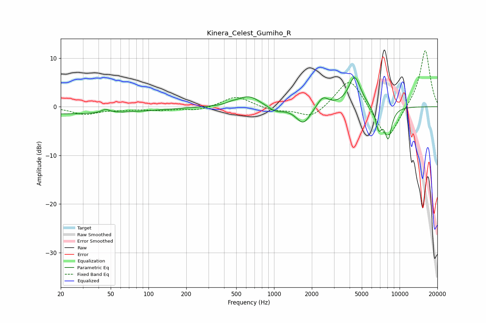

# Kinera_Celest_Gumiho_R
See [usage instructions](https://github.com/jaakkopasanen/AutoEq#usage) for more options and info.

### Parametric EQs
Apply preamp of -6.1 dB when using parametric equalizer.

|   # | Type    |   Fc (Hz) |    Q |   Gain (dB) |
|-----|---------|-----------|------|-------------|
|   1 | Peaking |        20 | 0.18 |        -1.5 |
|   2 | Peaking |        46 | 4.18 |         0.8 |
|   3 | Peaking |       461 | 4    |         0.3 |
|   4 | Peaking |       628 | 1.58 |         2.3 |
|   5 | Peaking |      1029 | 2.24 |        -1.1 |
|   6 | Peaking |      1711 | 2.47 |        -3.6 |
|   7 | Peaking |      2445 | 3.18 |         2.2 |
|   8 | Peaking |      4388 | 2.87 |         6.3 |
|   9 | Peaking |      6816 | 5.04 |        -4.4 |
|  10 | Peaking |      8109 | 4.6  |        -6.2 |

### Fixed Band EQs
When using fixed band (also called graphic) equalizer, apply preamp of **-11.6 dB** (if available) and set gains manually with these parameters.

|   # | Type    |   Fc (Hz) |    Q |   Gain (dB) |
|-----|---------|-----------|------|-------------|
|   1 | Peaking |        31 | 1.41 |        -1.5 |
|   2 | Peaking |        62 | 1.41 |        -0.5 |
|   3 | Peaking |       125 | 1.41 |        -0.6 |
|   4 | Peaking |       250 | 1.41 |        -0.7 |
|   5 | Peaking |       500 | 1.41 |         2.3 |
|   6 | Peaking |      1000 | 1.41 |        -0.8 |
|   7 | Peaking |      2000 | 1.41 |        -2.4 |
|   8 | Peaking |      4000 | 1.41 |         6.4 |
|   9 | Peaking |      8000 | 1.41 |        -7.4 |
|  10 | Peaking |     16000 | 1.41 |        11.9 |

### Graphs

