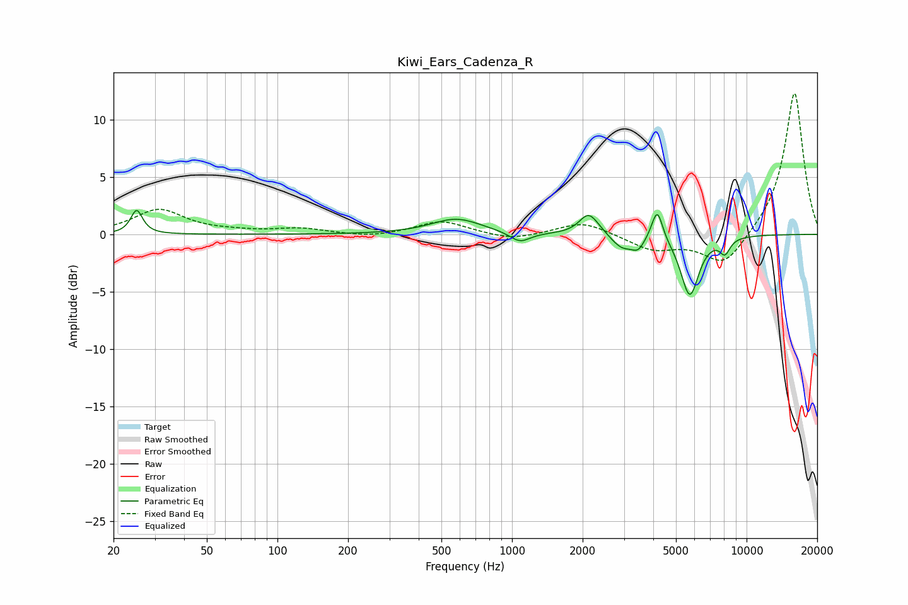

# Kiwi_Ears_Cadenza_R
See [usage instructions](https://github.com/jaakkopasanen/AutoEq#usage) for more options and info.

### Parametric EQs
Apply preamp of -2.2 dB when using parametric equalizer.

|   # | Type    |   Fc (Hz) |    Q |   Gain (dB) |
|-----|---------|-----------|------|-------------|
|   1 | Peaking |        25 | 5.93 |         2.1 |
|   2 | Peaking |       579 | 1.33 |         1.4 |
|   3 | Peaking |      1081 | 3.24 |        -0.9 |
|   4 | Peaking |      2107 | 3.73 |         1.5 |
|   5 | Peaking |      2248 | 3    |         0.5 |
|   6 | Peaking |      2948 | 2.94 |        -1.2 |
|   7 | Peaking |      3452 | 5.32 |        -0.9 |
|   8 | Peaking |      4159 | 6    |         2.8 |
|   9 | Peaking |      5726 | 3.59 |        -5.3 |
|  10 | Peaking |      8084 | 6    |        -1.3 |

### Fixed Band EQs
When using fixed band (also called graphic) equalizer, apply preamp of **-12.4 dB** (if available) and set gains manually with these parameters.

|   # | Type    |   Fc (Hz) |    Q |   Gain (dB) |
|-----|---------|-----------|------|-------------|
|   1 | Peaking |        31 | 1.41 |         2.1 |
|   2 | Peaking |        62 | 1.41 |         0.2 |
|   3 | Peaking |       125 | 1.41 |         0.5 |
|   4 | Peaking |       250 | 1.41 |        -0.3 |
|   5 | Peaking |       500 | 1.41 |         1.2 |
|   6 | Peaking |      1000 | 1.41 |        -0.5 |
|   7 | Peaking |      2000 | 1.41 |         1.2 |
|   8 | Peaking |      4000 | 1.41 |        -1.3 |
|   9 | Peaking |      8000 | 1.41 |        -2.9 |
|  10 | Peaking |     16000 | 1.41 |        12.5 |

### Graphs

