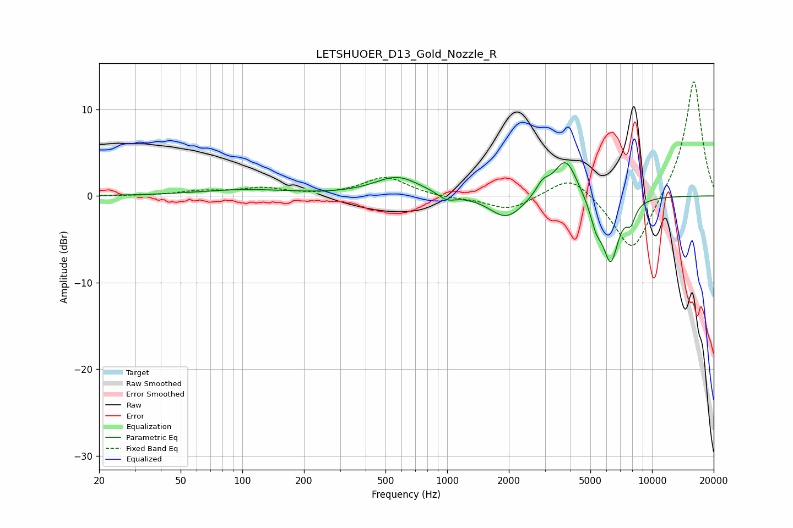

# LETSHUOER_D13_Gold_Nozzle_R
See [usage instructions](https://github.com/jaakkopasanen/AutoEq#usage) for more options and info.

### Parametric EQs
Apply preamp of -3.9 dB when using parametric equalizer.

|   # | Type    |   Fc (Hz) |    Q |   Gain (dB) |
|-----|---------|-----------|------|-------------|
|   1 | Peaking |       103 | 0.63 |         0.7 |
|   2 | Peaking |       571 | 1.26 |         2.2 |
|   3 | Peaking |       995 | 3.37 |        -0.8 |
|   4 | Peaking |      1947 | 1.74 |        -2.7 |
|   5 | Peaking |      2926 | 4.38 |         1.3 |
|   6 | Peaking |      3789 | 2.49 |         4.6 |
|   7 | Peaking |      5309 | 4.2  |        -1.7 |
|   8 | Peaking |      5385 | 5.98 |        -0.7 |
|   9 | Peaking |      6283 | 3.45 |        -7.3 |
|  10 | Peaking |      7879 | 5.88 |        -1.9 |

### Fixed Band EQs
When using fixed band (also called graphic) equalizer, apply preamp of **-13.3 dB** (if available) and set gains manually with these parameters.

|   # | Type    |   Fc (Hz) |    Q |   Gain (dB) |
|-----|---------|-----------|------|-------------|
|   1 | Peaking |        31 | 1.41 |        -0   |
|   2 | Peaking |        62 | 1.41 |         0.5 |
|   3 | Peaking |       125 | 1.41 |         0.8 |
|   4 | Peaking |       250 | 1.41 |         0   |
|   5 | Peaking |       500 | 1.41 |         2.2 |
|   6 | Peaking |      1000 | 1.41 |        -0.3 |
|   7 | Peaking |      2000 | 1.41 |        -1.7 |
|   8 | Peaking |      4000 | 1.41 |         2.6 |
|   9 | Peaking |      8000 | 1.41 |        -7   |
|  10 | Peaking |     16000 | 1.41 |        13.6 |

### Graphs

