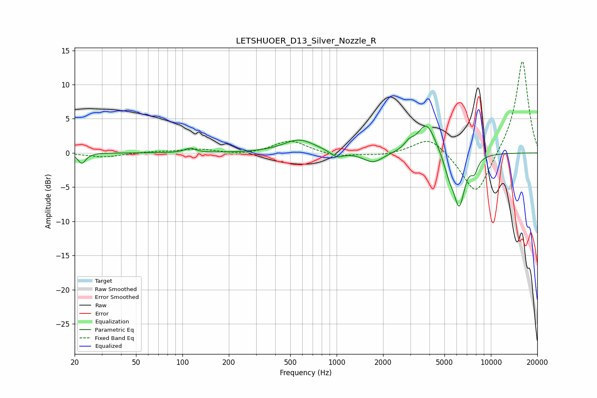

# LETSHUOER_D13_Silver_Nozzle_R
See [usage instructions](https://github.com/jaakkopasanen/AutoEq#usage) for more options and info.

### Parametric EQs
Apply preamp of -4.0 dB when using parametric equalizer.

|   # | Type    |   Fc (Hz) |    Q |   Gain (dB) |
|-----|---------|-----------|------|-------------|
|   1 | Peaking |        22 | 5.86 |        -1.5 |
|   2 | Peaking |       112 | 4.27 |         0.7 |
|   3 | Peaking |       573 | 1.38 |         1.9 |
|   4 | Peaking |      1003 | 3.51 |        -0.9 |
|   5 | Peaking |      1726 | 2.16 |        -1.5 |
|   6 | Peaking |      2946 | 4.7  |         0.9 |
|   7 | Peaking |      3829 | 2.41 |         4.5 |
|   8 | Peaking |      5356 | 4.12 |        -2.2 |
|   9 | Peaking |      6232 | 3.69 |        -7.5 |
|  10 | Peaking |      7827 | 5.99 |        -1.8 |

### Fixed Band EQs
When using fixed band (also called graphic) equalizer, apply preamp of **-13.5 dB** (if available) and set gains manually with these parameters.

|   # | Type    |   Fc (Hz) |    Q |   Gain (dB) |
|-----|---------|-----------|------|-------------|
|   1 | Peaking |        31 | 1.41 |        -0.6 |
|   2 | Peaking |        62 | 1.41 |         0.2 |
|   3 | Peaking |       125 | 1.41 |         0.5 |
|   4 | Peaking |       250 | 1.41 |        -0.3 |
|   5 | Peaking |       500 | 1.41 |         1.9 |
|   6 | Peaking |      1000 | 1.41 |        -0.6 |
|   7 | Peaking |      2000 | 1.41 |        -0.4 |
|   8 | Peaking |      4000 | 1.41 |         2.5 |
|   9 | Peaking |      8000 | 1.41 |        -6.6 |
|  10 | Peaking |     16000 | 1.41 |        13.8 |

### Graphs

