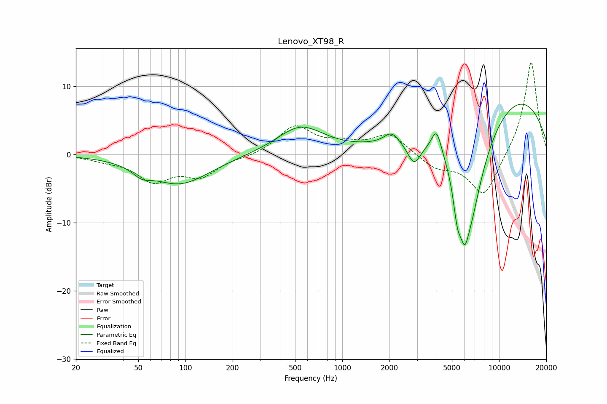

# Lenovo_XT98_R
See [usage instructions](https://github.com/jaakkopasanen/AutoEq#usage) for more options and info.

### Parametric EQs
Apply preamp of -7.5 dB when using parametric equalizer.

|   # | Type    |   Fc (Hz) |    Q |   Gain (dB) |
|-----|---------|-----------|------|-------------|
|   1 | Peaking |        53 | 2.49 |        -1.2 |
|   2 | Peaking |        92 | 0.73 |        -4.3 |
|   3 | Peaking |       541 | 0.94 |         4   |
|   4 | Peaking |      2062 | 3.03 |         1.7 |
|   5 | Peaking |      2867 | 3.4  |        -3.2 |
|   6 | Peaking |      3993 | 4.32 |         3.7 |
|   7 | Peaking |      5414 | 5.23 |        -5   |
|   8 | Peaking |      6020 | 4.73 |        -5.3 |
|   9 | Peaking |      6591 | 1.15 |       -17.1 |
|  10 | Peaking |     10000 | 0.29 |        11.2 |

### Fixed Band EQs
When using fixed band (also called graphic) equalizer, apply preamp of **-13.6 dB** (if available) and set gains manually with these parameters.

|   # | Type    |   Fc (Hz) |    Q |   Gain (dB) |
|-----|---------|-----------|------|-------------|
|   1 | Peaking |        31 | 1.41 |        -0.6 |
|   2 | Peaking |        62 | 1.41 |        -3.6 |
|   3 | Peaking |       125 | 1.41 |        -2.9 |
|   4 | Peaking |       250 | 1.41 |        -0.3 |
|   5 | Peaking |       500 | 1.41 |         4.1 |
|   6 | Peaking |      1000 | 1.41 |         1.2 |
|   7 | Peaking |      2000 | 1.41 |         3   |
|   8 | Peaking |      4000 | 1.41 |        -1.9 |
|   9 | Peaking |      8000 | 1.41 |        -6.3 |
|  10 | Peaking |     16000 | 1.41 |        13.9 |

### Graphs

