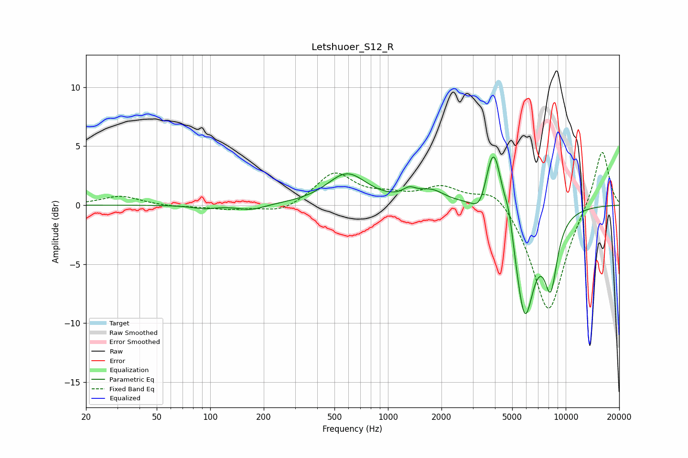

# Letshuoer_S12_R
See [usage instructions](https://github.com/jaakkopasanen/AutoEq#usage) for more options and info.

### Parametric EQs
Apply preamp of -4.2 dB when using parametric equalizer.

|   # | Type    |   Fc (Hz) |    Q |   Gain (dB) |
|-----|---------|-----------|------|-------------|
|   1 | Peaking |        92 | 2.16 |        -0.3 |
|   2 | Peaking |       170 | 1.84 |        -0.5 |
|   3 | Peaking |       588 | 1.28 |         2.6 |
|   4 | Peaking |      1318 | 3.82 |         0.7 |
|   5 | Peaking |      1755 | 1.81 |         1.1 |
|   6 | Peaking |      3316 | 3.29 |        -1.7 |
|   7 | Peaking |      3928 | 2.91 |         6.4 |
|   8 | Peaking |      4796 | 5.98 |         1.6 |
|   9 | Peaking |      5874 | 2.47 |        -9.5 |
|  10 | Peaking |      8238 | 3.49 |        -5.6 |

### Fixed Band EQs
When using fixed band (also called graphic) equalizer, apply preamp of **-4.6 dB** (if available) and set gains manually with these parameters.

|   # | Type    |   Fc (Hz) |    Q |   Gain (dB) |
|-----|---------|-----------|------|-------------|
|   1 | Peaking |        31 | 1.41 |         0.8 |
|   2 | Peaking |        62 | 1.41 |        -0.1 |
|   3 | Peaking |       125 | 1.41 |        -0.3 |
|   4 | Peaking |       250 | 1.41 |        -0.7 |
|   5 | Peaking |       500 | 1.41 |         2.7 |
|   6 | Peaking |      1000 | 1.41 |         0.6 |
|   7 | Peaking |      2000 | 1.41 |         1.4 |
|   8 | Peaking |      4000 | 1.41 |         1.7 |
|   9 | Peaking |      8000 | 1.41 |        -9.3 |
|  10 | Peaking |     16000 | 1.41 |         5   |

### Graphs

