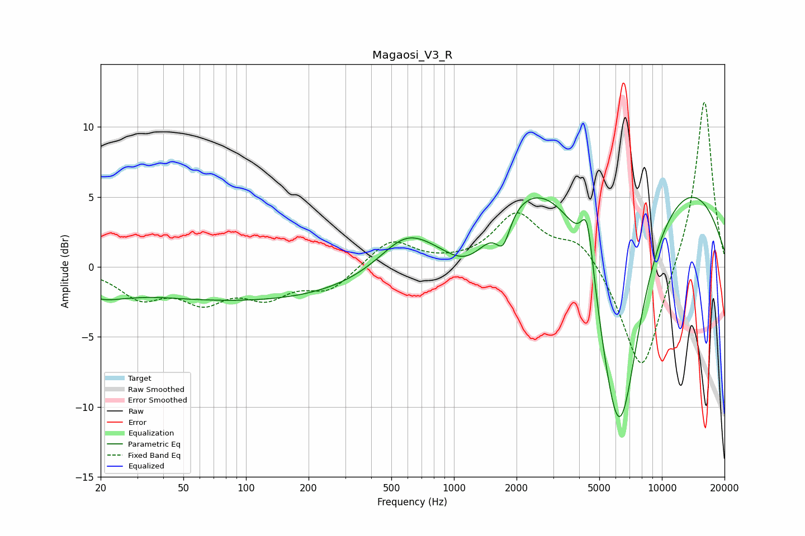

# Magaosi_V3_R
See [usage instructions](https://github.com/jaakkopasanen/AutoEq#usage) for more options and info.

### Parametric EQs
Apply preamp of -5.1 dB when using parametric equalizer.

|   # | Type    |   Fc (Hz) |    Q |   Gain (dB) |
|-----|---------|-----------|------|-------------|
|   1 | Peaking |        20 | 1.3  |        -1.2 |
|   2 | Peaking |        29 | 3.4  |        -0   |
|   3 | Peaking |       126 | 0.18 |        -2.5 |
|   4 | Peaking |       583 | 1.19 |         1.9 |
|   5 | Peaking |      1184 | 0.98 |        -4.8 |
|   6 | Peaking |      1724 | 4.05 |        -2.2 |
|   7 | Peaking |      4377 | 4.57 |         4.2 |
|   8 | Peaking |      5209 | 0.18 |        11.9 |
|   9 | Peaking |      5963 | 1.45 |        -5.6 |
|  10 | Peaking |      6318 | 1    |       -17.1 |

### Fixed Band EQs
When using fixed band (also called graphic) equalizer, apply preamp of **-11.9 dB** (if available) and set gains manually with these parameters.

|   # | Type    |   Fc (Hz) |    Q |   Gain (dB) |
|-----|---------|-----------|------|-------------|
|   1 | Peaking |        31 | 1.41 |        -2   |
|   2 | Peaking |        62 | 1.41 |        -2.1 |
|   3 | Peaking |       125 | 1.41 |        -1.8 |
|   4 | Peaking |       250 | 1.41 |        -1.6 |
|   5 | Peaking |       500 | 1.41 |         2   |
|   6 | Peaking |      1000 | 1.41 |         0.1 |
|   7 | Peaking |      2000 | 1.41 |         3.7 |
|   8 | Peaking |      4000 | 1.41 |         2   |
|   9 | Peaking |      8000 | 1.41 |        -8   |
|  10 | Peaking |     16000 | 1.41 |        12.3 |

### Graphs

