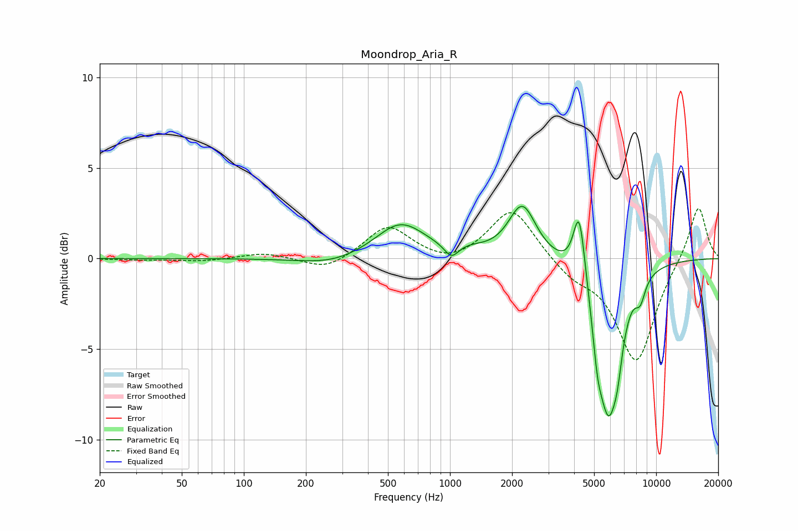

# Moondrop_Aria_R
See [usage instructions](https://github.com/jaakkopasanen/AutoEq#usage) for more options and info.

### Parametric EQs
Apply preamp of -3.0 dB when using parametric equalizer.

|   # | Type    |   Fc (Hz) |    Q |   Gain (dB) |
|-----|---------|-----------|------|-------------|
|   1 | Peaking |       267 | 0.93 |        -0.4 |
|   2 | Peaking |       576 | 1.16 |         2   |
|   3 | Peaking |      1016 | 4.17 |        -0.8 |
|   4 | Peaking |      1255 | 1.94 |         0.2 |
|   5 | Peaking |      2243 | 2.13 |         2.9 |
|   6 | Peaking |      4237 | 4.88 |         3.9 |
|   7 | Peaking |      5190 | 6    |        -1.9 |
|   8 | Peaking |      5870 | 2.54 |        -8.1 |
|   9 | Peaking |      6505 | 6    |        -1.3 |
|  10 | Peaking |      8374 | 5.36 |        -1.1 |

### Fixed Band EQs
When using fixed band (also called graphic) equalizer, apply preamp of **-2.9 dB** (if available) and set gains manually with these parameters.

|   # | Type    |   Fc (Hz) |    Q |   Gain (dB) |
|-----|---------|-----------|------|-------------|
|   1 | Peaking |        31 | 1.41 |        -0.1 |
|   2 | Peaking |        62 | 1.41 |        -0.2 |
|   3 | Peaking |       125 | 1.41 |         0.3 |
|   4 | Peaking |       250 | 1.41 |        -0.7 |
|   5 | Peaking |       500 | 1.41 |         1.8 |
|   6 | Peaking |      1000 | 1.41 |        -0.4 |
|   7 | Peaking |      2000 | 1.41 |         2.9 |
|   8 | Peaking |      4000 | 1.41 |        -0.9 |
|   9 | Peaking |      8000 | 1.41 |        -5.7 |
|  10 | Peaking |     16000 | 1.41 |         3.1 |

### Graphs

