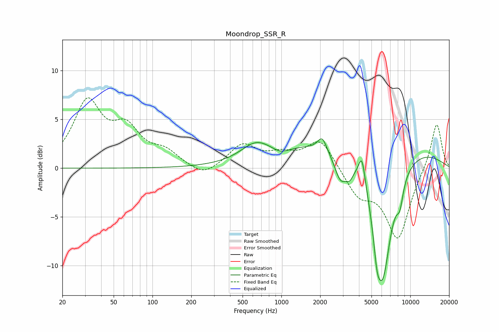

# Moondrop_SSR_R
See [usage instructions](https://github.com/jaakkopasanen/AutoEq#usage) for more options and info.

### Parametric EQs
Apply preamp of -3.1 dB when using parametric equalizer.

|   # | Type    |   Fc (Hz) |    Q |   Gain (dB) |
|-----|---------|-----------|------|-------------|
|   1 | Peaking |       633 | 1.27 |         1.7 |
|   2 | Peaking |       988 | 2.13 |        -0.6 |
|   3 | Peaking |      2074 | 4.12 |         1.4 |
|   4 | Peaking |      2878 | 2.94 |        -2.7 |
|   5 | Peaking |      3383 | 5.22 |        -1   |
|   6 | Peaking |      4216 | 5.37 |         2.9 |
|   7 | Peaking |      4364 | 0.18 |         3   |
|   8 | Peaking |      5508 | 5.91 |        -2.4 |
|   9 | Peaking |      6080 | 1.8  |       -13.4 |
|  10 | Peaking |      8303 | 5.06 |        -2.1 |

### Fixed Band EQs
When using fixed band (also called graphic) equalizer, apply preamp of **-7.3 dB** (if available) and set gains manually with these parameters.

|   # | Type    |   Fc (Hz) |    Q |   Gain (dB) |
|-----|---------|-----------|------|-------------|
|   1 | Peaking |        31 | 1.41 |         6.5 |
|   2 | Peaking |        62 | 1.41 |         3.5 |
|   3 | Peaking |       125 | 1.41 |         1.4 |
|   4 | Peaking |       250 | 1.41 |        -1.1 |
|   5 | Peaking |       500 | 1.41 |         2.3 |
|   6 | Peaking |      1000 | 1.41 |         1.1 |
|   7 | Peaking |      2000 | 1.41 |         3   |
|   8 | Peaking |      4000 | 1.41 |        -2.6 |
|   9 | Peaking |      8000 | 1.41 |        -7.1 |
|  10 | Peaking |     16000 | 1.41 |         4.8 |

### Graphs

