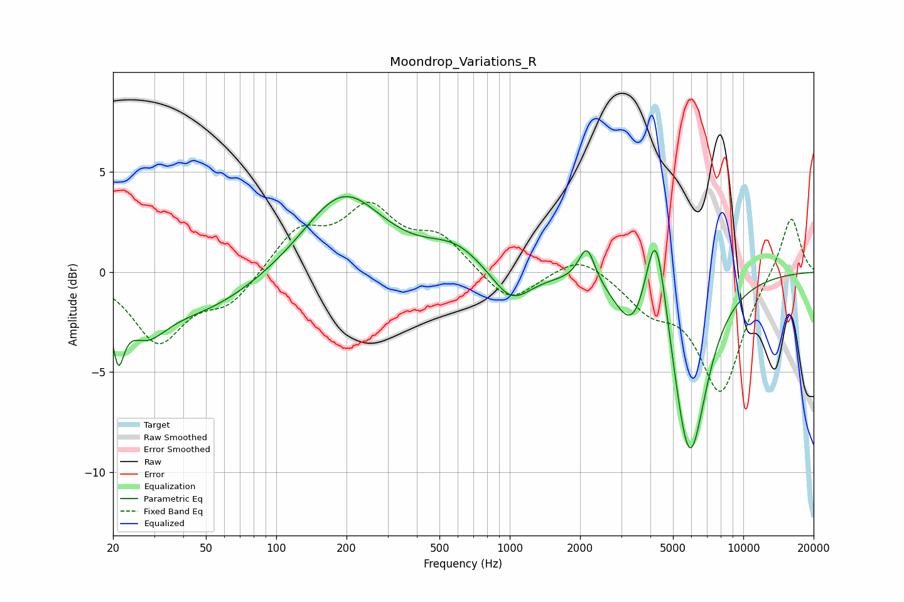

# Moondrop_Variations_R
See [usage instructions](https://github.com/jaakkopasanen/AutoEq#usage) for more options and info.

### Parametric EQs
Apply preamp of -3.9 dB when using parametric equalizer.

|   # | Type    |   Fc (Hz) |    Q |   Gain (dB) |
|-----|---------|-----------|------|-------------|
|   1 | Peaking |        21 | 5.77 |        -2.7 |
|   2 | Peaking |        28 | 1.57 |        -2   |
|   3 | Peaking |        48 | 0.58 |        -1.9 |
|   4 | Peaking |       193 | 0.85 |         4   |
|   5 | Peaking |       583 | 1.18 |         1.2 |
|   6 | Peaking |      1015 | 1.68 |        -1.7 |
|   7 | Peaking |      2138 | 4.11 |         1.9 |
|   8 | Peaking |      3369 | 2    |        -2.4 |
|   9 | Peaking |      4222 | 3.05 |         5.6 |
|  10 | Peaking |      5883 | 1.86 |        -9.4 |

### Fixed Band EQs
When using fixed band (also called graphic) equalizer, apply preamp of **-3.6 dB** (if available) and set gains manually with these parameters.

|   # | Type    |   Fc (Hz) |    Q |   Gain (dB) |
|-----|---------|-----------|------|-------------|
|   1 | Peaking |        31 | 1.41 |        -3.4 |
|   2 | Peaking |        62 | 1.41 |        -1.5 |
|   3 | Peaking |       125 | 1.41 |         2   |
|   4 | Peaking |       250 | 1.41 |         3   |
|   5 | Peaking |       500 | 1.41 |         1.6 |
|   6 | Peaking |      1000 | 1.41 |        -1.6 |
|   7 | Peaking |      2000 | 1.41 |         1   |
|   8 | Peaking |      4000 | 1.41 |        -1.6 |
|   9 | Peaking |      8000 | 1.41 |        -5.9 |
|  10 | Peaking |     16000 | 1.41 |         3   |

### Graphs

