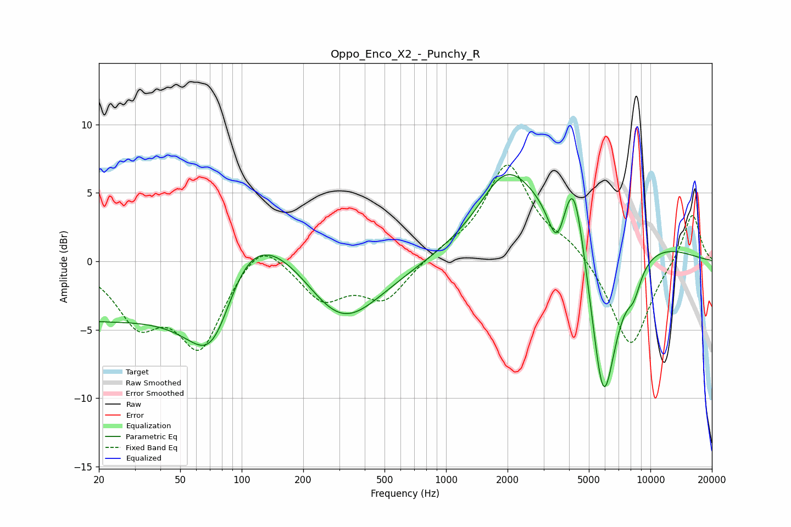

# Oppo_Enco_X2_-_Punchy_R
See [usage instructions](https://github.com/jaakkopasanen/AutoEq#usage) for more options and info.

### Parametric EQs
Apply preamp of -6.4 dB when using parametric equalizer.

|   # | Type    |   Fc (Hz) |    Q |   Gain (dB) |
|-----|---------|-----------|------|-------------|
|   1 | Peaking |        20 | 0.24 |        -4.6 |
|   2 | Peaking |        73 | 0.7  |       -15.7 |
|   3 | Peaking |        94 | 0.47 |        14.9 |
|   4 | Peaking |       305 | 0.68 |        -6.7 |
|   5 | Peaking |      1953 | 1.1  |         4.3 |
|   6 | Peaking |      3490 | 3.23 |        -3.4 |
|   7 | Peaking |      4212 | 2.69 |         5.7 |
|   8 | Peaking |      4985 | 0.46 |         7.5 |
|   9 | Peaking |      5885 | 1.5  |       -17.5 |
|  10 | Peaking |      8309 | 3.66 |        -1.6 |

### Fixed Band EQs
When using fixed band (also called graphic) equalizer, apply preamp of **-7.1 dB** (if available) and set gains manually with these parameters.

|   # | Type    |   Fc (Hz) |    Q |   Gain (dB) |
|-----|---------|-----------|------|-------------|
|   1 | Peaking |        31 | 1.41 |        -4   |
|   2 | Peaking |        62 | 1.41 |        -6   |
|   3 | Peaking |       125 | 1.41 |         2.2 |
|   4 | Peaking |       250 | 1.41 |        -2.7 |
|   5 | Peaking |       500 | 1.41 |        -2.7 |
|   6 | Peaking |      1000 | 1.41 |         0.6 |
|   7 | Peaking |      2000 | 1.41 |         7   |
|   8 | Peaking |      4000 | 1.41 |         1.1 |
|   9 | Peaking |      8000 | 1.41 |        -6.5 |
|  10 | Peaking |     16000 | 1.41 |         3.7 |

### Graphs

