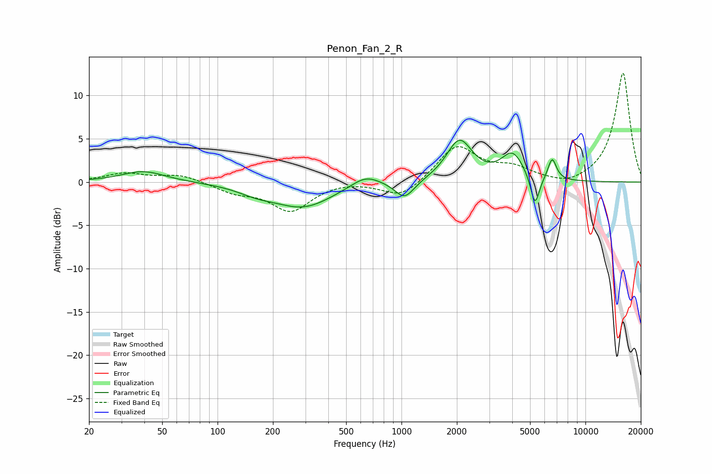

# Penon_Fan_2_R
See [usage instructions](https://github.com/jaakkopasanen/AutoEq#usage) for more options and info.

### Parametric EQs
Apply preamp of -4.9 dB when using parametric equalizer.

|   # | Type    |   Fc (Hz) |    Q |   Gain (dB) |
|-----|---------|-----------|------|-------------|
|   1 | Peaking |        39 | 1.2  |         1.3 |
|   2 | Peaking |       163 | 1.4  |        -0.7 |
|   3 | Peaking |       292 | 0.87 |        -2.8 |
|   4 | Peaking |       638 | 1.79 |         1.3 |
|   5 | Peaking |      1039 | 2.85 |        -1.6 |
|   6 | Peaking |      1045 | 2.1  |        -0.4 |
|   7 | Peaking |      2065 | 2.01 |         4.7 |
|   8 | Peaking |      4018 | 2.29 |         3.1 |
|   9 | Peaking |      5318 | 5.71 |        -3.7 |
|  10 | Peaking |      6595 | 5.98 |         2.5 |

### Fixed Band EQs
When using fixed band (also called graphic) equalizer, apply preamp of **-12.7 dB** (if available) and set gains manually with these parameters.

|   # | Type    |   Fc (Hz) |    Q |   Gain (dB) |
|-----|---------|-----------|------|-------------|
|   1 | Peaking |        31 | 1.41 |         1   |
|   2 | Peaking |        62 | 1.41 |         0.8 |
|   3 | Peaking |       125 | 1.41 |        -1.1 |
|   4 | Peaking |       250 | 1.41 |        -3.2 |
|   5 | Peaking |       500 | 1.41 |         0.2 |
|   6 | Peaking |      1000 | 1.41 |        -1.9 |
|   7 | Peaking |      2000 | 1.41 |         4.2 |
|   8 | Peaking |      4000 | 1.41 |         1.4 |
|   9 | Peaking |      8000 | 1.41 |        -0.7 |
|  10 | Peaking |     16000 | 1.41 |        12.7 |

### Graphs

