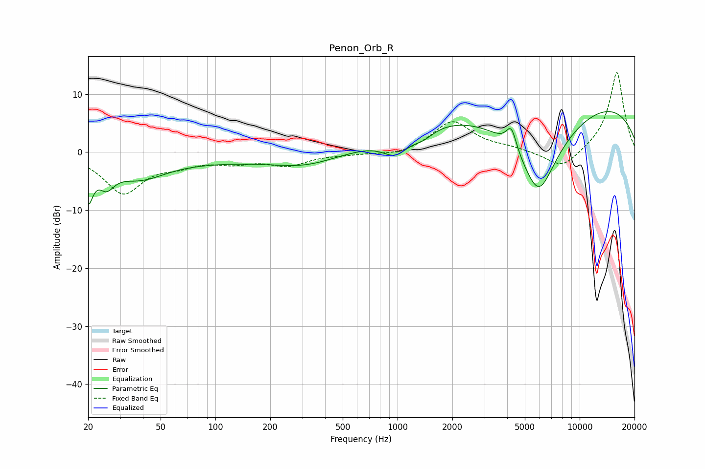

# Penon_Orb_R
See [usage instructions](https://github.com/jaakkopasanen/AutoEq#usage) for more options and info.

### Parametric EQs
Apply preamp of -7.1 dB when using parametric equalizer.

|   # | Type    |   Fc (Hz) |    Q |   Gain (dB) |
|-----|---------|-----------|------|-------------|
|   1 | Peaking |        20 | 5.47 |        -6.4 |
|   2 | Peaking |        25 | 3.31 |        -3.3 |
|   3 | Peaking |        38 | 0.98 |        -3.6 |
|   4 | Peaking |       172 | 0.21 |        -1.5 |
|   5 | Peaking |       313 | 0.86 |        -1.4 |
|   6 | Peaking |       976 | 1.96 |        -3.3 |
|   7 | Peaking |      1385 | 2.42 |        -1.5 |
|   8 | Peaking |      4216 | 4.91 |         3.9 |
|   9 | Peaking |      5948 | 0.84 |       -20   |
|  10 | Peaking |      6703 | 0.18 |        13.9 |

### Fixed Band EQs
When using fixed band (also called graphic) equalizer, apply preamp of **-13.8 dB** (if available) and set gains manually with these parameters.

|   # | Type    |   Fc (Hz) |    Q |   Gain (dB) |
|-----|---------|-----------|------|-------------|
|   1 | Peaking |        31 | 1.41 |        -6.9 |
|   2 | Peaking |        62 | 1.41 |        -1.6 |
|   3 | Peaking |       125 | 1.41 |        -1.5 |
|   4 | Peaking |       250 | 1.41 |        -2.1 |
|   5 | Peaking |       500 | 1.41 |        -0.3 |
|   6 | Peaking |      1000 | 1.41 |        -0.7 |
|   7 | Peaking |      2000 | 1.41 |         5.3 |
|   8 | Peaking |      4000 | 1.41 |         0.6 |
|   9 | Peaking |      8000 | 1.41 |        -3.2 |
|  10 | Peaking |     16000 | 1.41 |        14   |

### Graphs

