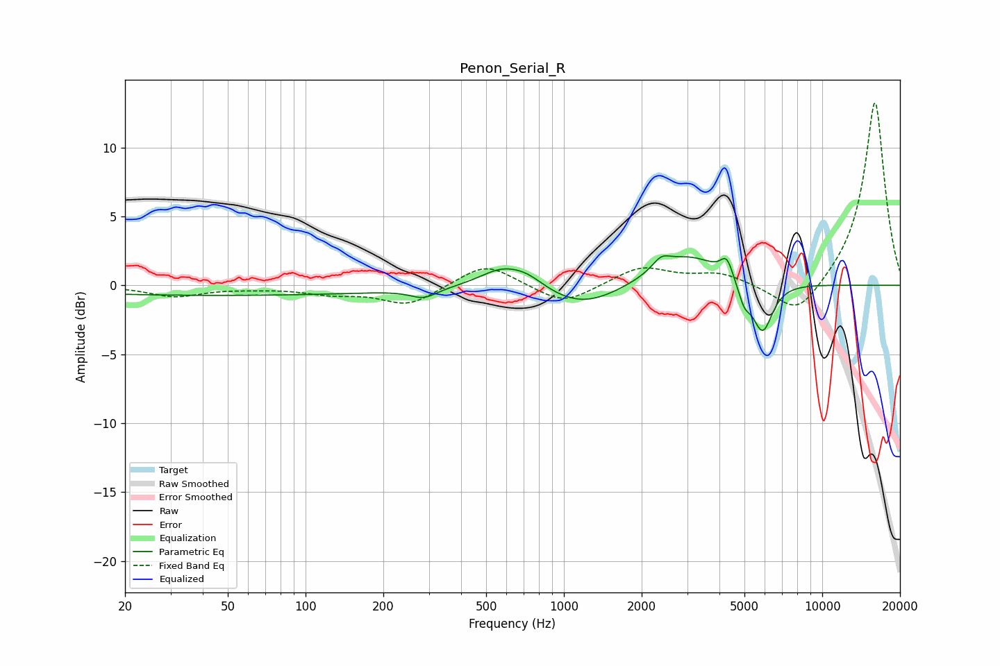

# Penon_Serial_R
See [usage instructions](https://github.com/jaakkopasanen/AutoEq#usage) for more options and info.

### Parametric EQs
Apply preamp of -2.2 dB when using parametric equalizer.

|   # | Type    |   Fc (Hz) |    Q |   Gain (dB) |
|-----|---------|-----------|------|-------------|
|   1 | Peaking |        46 | 0.18 |        -0.7 |
|   2 | Peaking |       287 | 2.69 |        -0.7 |
|   3 | Peaking |       578 | 1.58 |         1.4 |
|   4 | Peaking |       724 | 2.11 |         0.7 |
|   5 | Peaking |      1186 | 0.97 |        -1.7 |
|   6 | Peaking |      2380 | 4.19 |         0.8 |
|   7 | Peaking |      3020 | 1.05 |         2.3 |
|   8 | Peaking |      4270 | 6    |         1.4 |
|   9 | Peaking |      4991 | 5.72 |        -1.4 |
|  10 | Peaking |      5872 | 3.52 |        -3.7 |

### Fixed Band EQs
When using fixed band (also called graphic) equalizer, apply preamp of **-13.3 dB** (if available) and set gains manually with these parameters.

|   # | Type    |   Fc (Hz) |    Q |   Gain (dB) |
|-----|---------|-----------|------|-------------|
|   1 | Peaking |        31 | 1.41 |        -0.8 |
|   2 | Peaking |        62 | 1.41 |        -0.1 |
|   3 | Peaking |       125 | 1.41 |        -0.5 |
|   4 | Peaking |       250 | 1.41 |        -1.4 |
|   5 | Peaking |       500 | 1.41 |         1.7 |
|   6 | Peaking |      1000 | 1.41 |        -1.4 |
|   7 | Peaking |      2000 | 1.41 |         1.3 |
|   8 | Peaking |      4000 | 1.41 |         0.8 |
|   9 | Peaking |      8000 | 1.41 |        -2.5 |
|  10 | Peaking |     16000 | 1.41 |        13.4 |

### Graphs

