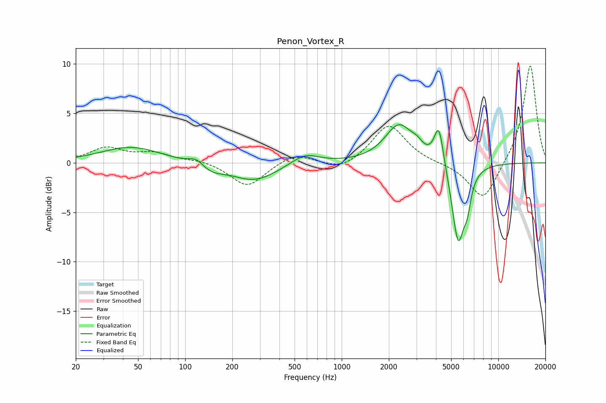

# Penon_Vortex_R
See [usage instructions](https://github.com/jaakkopasanen/AutoEq#usage) for more options and info.

### Parametric EQs
Apply preamp of -4.0 dB when using parametric equalizer.

|   # | Type    |   Fc (Hz) |    Q |   Gain (dB) |
|-----|---------|-----------|------|-------------|
|   1 | Peaking |        45 | 0.74 |         1.6 |
|   2 | Peaking |       118 | 3.25 |         0.7 |
|   3 | Peaking |       148 | 1.84 |        -0.7 |
|   4 | Peaking |       277 | 0.96 |        -1.8 |
|   5 | Peaking |       583 | 1.61 |         1.1 |
|   6 | Peaking |      2324 | 1.58 |         3.8 |
|   7 | Peaking |      3026 | 4.01 |         0.6 |
|   8 | Peaking |      4174 | 4.75 |         4   |
|   9 | Peaking |      5545 | 3.39 |        -8.1 |
|  10 | Peaking |      6346 | 5.98 |        -2.2 |

### Fixed Band EQs
When using fixed band (also called graphic) equalizer, apply preamp of **-9.9 dB** (if available) and set gains manually with these parameters.

|   # | Type    |   Fc (Hz) |    Q |   Gain (dB) |
|-----|---------|-----------|------|-------------|
|   1 | Peaking |        31 | 1.41 |         1.4 |
|   2 | Peaking |        62 | 1.41 |         0.9 |
|   3 | Peaking |       125 | 1.41 |         0.3 |
|   4 | Peaking |       250 | 1.41 |        -2.5 |
|   5 | Peaking |       500 | 1.41 |         1   |
|   6 | Peaking |      1000 | 1.41 |        -0.9 |
|   7 | Peaking |      2000 | 1.41 |         3.9 |
|   8 | Peaking |      4000 | 1.41 |        -0.1 |
|   9 | Peaking |      8000 | 1.41 |        -4   |
|  10 | Peaking |     16000 | 1.41 |        10   |

### Graphs

