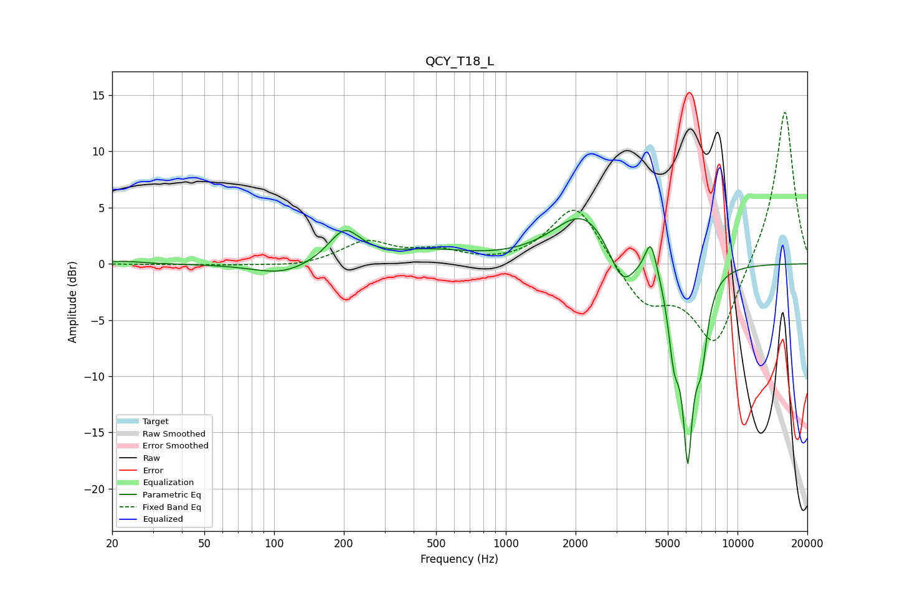

# QCY_T18_L
See [usage instructions](https://github.com/jaakkopasanen/AutoEq#usage) for more options and info.

### Parametric EQs
Apply preamp of -4.1 dB when using parametric equalizer.

|   # | Type    |   Fc (Hz) |    Q |   Gain (dB) |
|-----|---------|-----------|------|-------------|
|   1 | Peaking |        22 | 1.76 |         0.2 |
|   2 | Peaking |       109 | 1.14 |        -1   |
|   3 | Peaking |       202 | 2.05 |         2.9 |
|   4 | Peaking |       462 | 0.79 |         1   |
|   5 | Peaking |      2178 | 1.09 |         4.7 |
|   6 | Peaking |      3179 | 2.45 |        -3.5 |
|   7 | Peaking |      4225 | 5.7  |         3   |
|   8 | Peaking |      5320 | 5.55 |        -5.7 |
|   9 | Peaking |      6097 | 5.91 |       -15.1 |
|  10 | Peaking |      6974 | 4.94 |        -5.8 |

### Fixed Band EQs
When using fixed band (also called graphic) equalizer, apply preamp of **-13.6 dB** (if available) and set gains manually with these parameters.

|   # | Type    |   Fc (Hz) |    Q |   Gain (dB) |
|-----|---------|-----------|------|-------------|
|   1 | Peaking |        31 | 1.41 |        -0   |
|   2 | Peaking |        62 | 1.41 |        -0.1 |
|   3 | Peaking |       125 | 1.41 |        -0.3 |
|   4 | Peaking |       250 | 1.41 |         1.9 |
|   5 | Peaking |       500 | 1.41 |         1   |
|   6 | Peaking |      1000 | 1.41 |        -0.1 |
|   7 | Peaking |      2000 | 1.41 |         5.5 |
|   8 | Peaking |      4000 | 1.41 |        -3.6 |
|   9 | Peaking |      8000 | 1.41 |        -7.4 |
|  10 | Peaking |     16000 | 1.41 |        14   |

### Graphs

