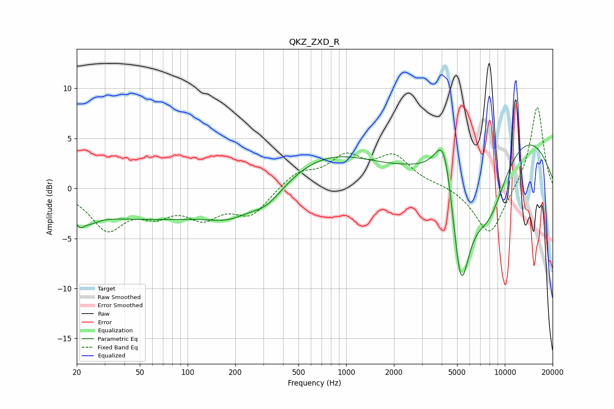

# QKZ_ZXD_R
See [usage instructions](https://github.com/jaakkopasanen/AutoEq#usage) for more options and info.

### Parametric EQs
Apply preamp of -4.4 dB when using parametric equalizer.

|   # | Type    |   Fc (Hz) |    Q |   Gain (dB) |
|-----|---------|-----------|------|-------------|
|   1 | Peaking |        21 | 4.95 |        -1.1 |
|   2 | Peaking |        24 | 2.78 |        -0.7 |
|   3 | Peaking |        65 | 0.18 |        -3.1 |
|   4 | Peaking |       182 | 1.21 |        -1   |
|   5 | Peaking |       316 | 1.41 |        -1.5 |
|   6 | Peaking |       747 | 0.48 |         3.5 |
|   7 | Peaking |      4145 | 2.47 |         6.1 |
|   8 | Peaking |      5276 | 2.23 |       -12.6 |
|   9 | Peaking |      7942 | 1.01 |        -7.9 |
|  10 | Peaking |     10000 | 0.31 |         7.1 |

### Fixed Band EQs
When using fixed band (also called graphic) equalizer, apply preamp of **-8.2 dB** (if available) and set gains manually with these parameters.

|   # | Type    |   Fc (Hz) |    Q |   Gain (dB) |
|-----|---------|-----------|------|-------------|
|   1 | Peaking |        31 | 1.41 |        -3.9 |
|   2 | Peaking |        62 | 1.41 |        -2   |
|   3 | Peaking |       125 | 1.41 |        -2.5 |
|   4 | Peaking |       250 | 1.41 |        -2.5 |
|   5 | Peaking |       500 | 1.41 |         1.6 |
|   6 | Peaking |      1000 | 1.41 |         2.8 |
|   7 | Peaking |      2000 | 1.41 |         2.9 |
|   8 | Peaking |      4000 | 1.41 |         0.3 |
|   9 | Peaking |      8000 | 1.41 |        -4.9 |
|  10 | Peaking |     16000 | 1.41 |         8.4 |

### Graphs

