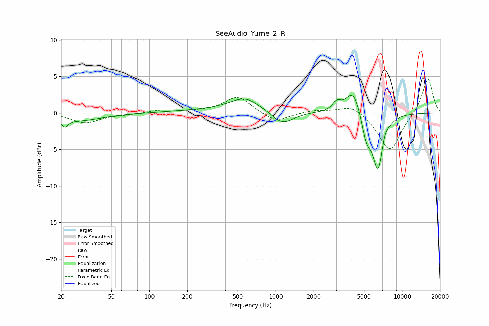

# SeeAudio_Yume_2_R
See [usage instructions](https://github.com/jaakkopasanen/AutoEq#usage) for more options and info.

### Parametric EQs
Apply preamp of -2.5 dB when using parametric equalizer.

|   # | Type    |   Fc (Hz) |    Q |   Gain (dB) |
|-----|---------|-----------|------|-------------|
|   1 | Peaking |        21 | 5.93 |        -1.1 |
|   2 | Peaking |        27 | 0.75 |        -1   |
|   3 | Peaking |       505 | 0.31 |         0.4 |
|   4 | Peaking |       573 | 1.19 |         1.8 |
|   5 | Peaking |      1125 | 1.54 |        -2   |
|   6 | Peaking |      3040 | 4.37 |         1.1 |
|   7 | Peaking |      4118 | 2.38 |         3.5 |
|   8 | Peaking |      5213 | 3.54 |        -3.2 |
|   9 | Peaking |      6443 | 3.18 |        -7.5 |
|  10 | Peaking |      7280 | 6    |         0.8 |

### Fixed Band EQs
When using fixed band (also called graphic) equalizer, apply preamp of **-4.7 dB** (if available) and set gains manually with these parameters.

|   # | Type    |   Fc (Hz) |    Q |   Gain (dB) |
|-----|---------|-----------|------|-------------|
|   1 | Peaking |        31 | 1.41 |        -1.3 |
|   2 | Peaking |        62 | 1.41 |        -0.2 |
|   3 | Peaking |       125 | 1.41 |         0.4 |
|   4 | Peaking |       250 | 1.41 |         0.1 |
|   5 | Peaking |       500 | 1.41 |         2.3 |
|   6 | Peaking |      1000 | 1.41 |        -1.3 |
|   7 | Peaking |      2000 | 1.41 |         0.4 |
|   8 | Peaking |      4000 | 1.41 |         1.2 |
|   9 | Peaking |      8000 | 1.41 |        -5.3 |
|  10 | Peaking |     16000 | 1.41 |         4.9 |

### Graphs

