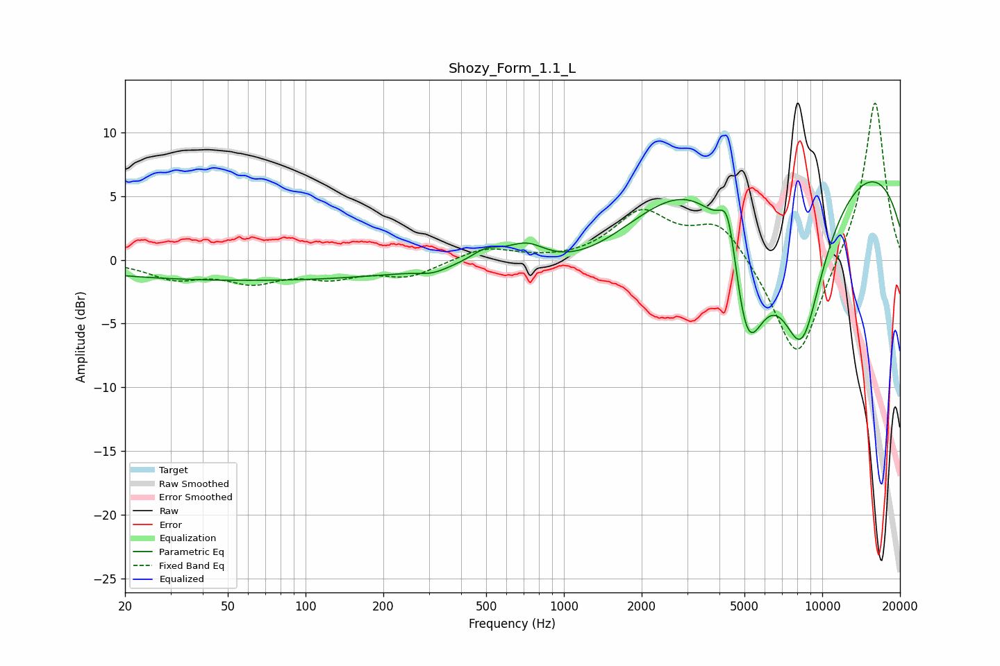

# Shozy_Form_1.1_L
See [usage instructions](https://github.com/jaakkopasanen/AutoEq#usage) for more options and info.

### Parametric EQs
Apply preamp of -6.2 dB when using parametric equalizer.

|   # | Type    |   Fc (Hz) |    Q |   Gain (dB) |
|-----|---------|-----------|------|-------------|
|   1 | Peaking |        60 | 0.2  |        -1.6 |
|   2 | Peaking |       310 | 2.56 |        -0.4 |
|   3 | Peaking |       499 | 2.3  |         1   |
|   4 | Peaking |       716 | 1.88 |         1.5 |
|   5 | Peaking |      1202 | 0.65 |        -2   |
|   6 | Peaking |      3964 | 0.57 |         4.4 |
|   7 | Peaking |      4322 | 4.01 |         4.8 |
|   8 | Peaking |      5108 | 1.59 |       -13.8 |
|   9 | Peaking |      8321 | 1.21 |       -13.9 |
|  10 | Peaking |      9677 | 0.2  |         9.2 |

### Fixed Band EQs
When using fixed band (also called graphic) equalizer, apply preamp of **-12.4 dB** (if available) and set gains manually with these parameters.

|   # | Type    |   Fc (Hz) |    Q |   Gain (dB) |
|-----|---------|-----------|------|-------------|
|   1 | Peaking |        31 | 1.41 |        -1.3 |
|   2 | Peaking |        62 | 1.41 |        -1.5 |
|   3 | Peaking |       125 | 1.41 |        -1.2 |
|   4 | Peaking |       250 | 1.41 |        -1.2 |
|   5 | Peaking |       500 | 1.41 |         1   |
|   6 | Peaking |      1000 | 1.41 |        -0.1 |
|   7 | Peaking |      2000 | 1.41 |         3.6 |
|   8 | Peaking |      4000 | 1.41 |         3.1 |
|   9 | Peaking |      8000 | 1.41 |        -8.4 |
|  10 | Peaking |     16000 | 1.41 |        12.8 |

### Graphs

