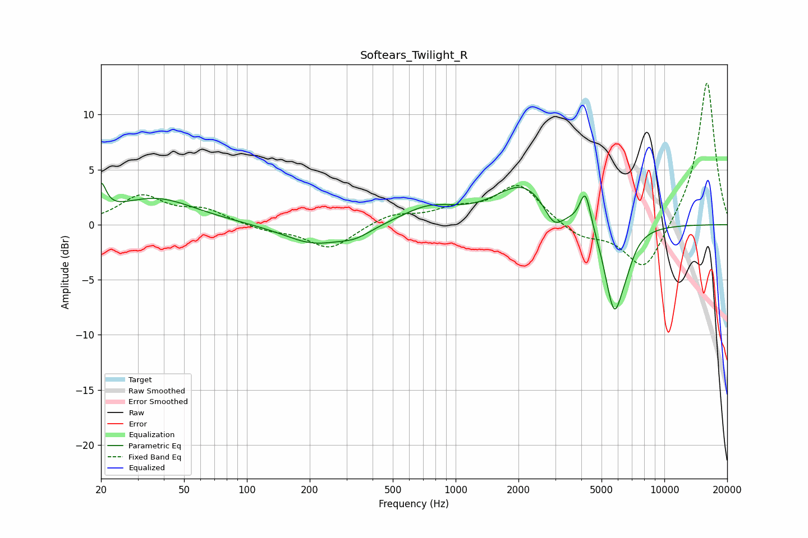

# Softears_Twilight_R
See [usage instructions](https://github.com/jaakkopasanen/AutoEq#usage) for more options and info.

### Parametric EQs
Apply preamp of -3.9 dB when using parametric equalizer.

|   # | Type    |   Fc (Hz) |    Q |   Gain (dB) |
|-----|---------|-----------|------|-------------|
|   1 | Peaking |        20 | 5.97 |         2.5 |
|   2 | Peaking |        36 | 0.74 |         2.4 |
|   3 | Peaking |       208 | 0.99 |        -1.7 |
|   4 | Peaking |       331 | 1.75 |        -0.8 |
|   5 | Peaking |       744 | 1.08 |         1.5 |
|   6 | Peaking |      2122 | 1.04 |         3.6 |
|   7 | Peaking |      2954 | 3.03 |        -2   |
|   8 | Peaking |      4185 | 5.23 |         3.4 |
|   9 | Peaking |      5749 | 3.04 |        -7.8 |
|  10 | Peaking |      6616 | 3.67 |        -1.2 |

### Fixed Band EQs
When using fixed band (also called graphic) equalizer, apply preamp of **-13.0 dB** (if available) and set gains manually with these parameters.

|   # | Type    |   Fc (Hz) |    Q |   Gain (dB) |
|-----|---------|-----------|------|-------------|
|   1 | Peaking |        31 | 1.41 |         2.5 |
|   2 | Peaking |        62 | 1.41 |         1.2 |
|   3 | Peaking |       125 | 1.41 |        -0.5 |
|   4 | Peaking |       250 | 1.41 |        -2.2 |
|   5 | Peaking |       500 | 1.41 |         0.9 |
|   6 | Peaking |      1000 | 1.41 |         1.1 |
|   7 | Peaking |      2000 | 1.41 |         3.6 |
|   8 | Peaking |      4000 | 1.41 |        -1.2 |
|   9 | Peaking |      8000 | 1.41 |        -4.4 |
|  10 | Peaking |     16000 | 1.41 |        13.2 |

### Graphs

