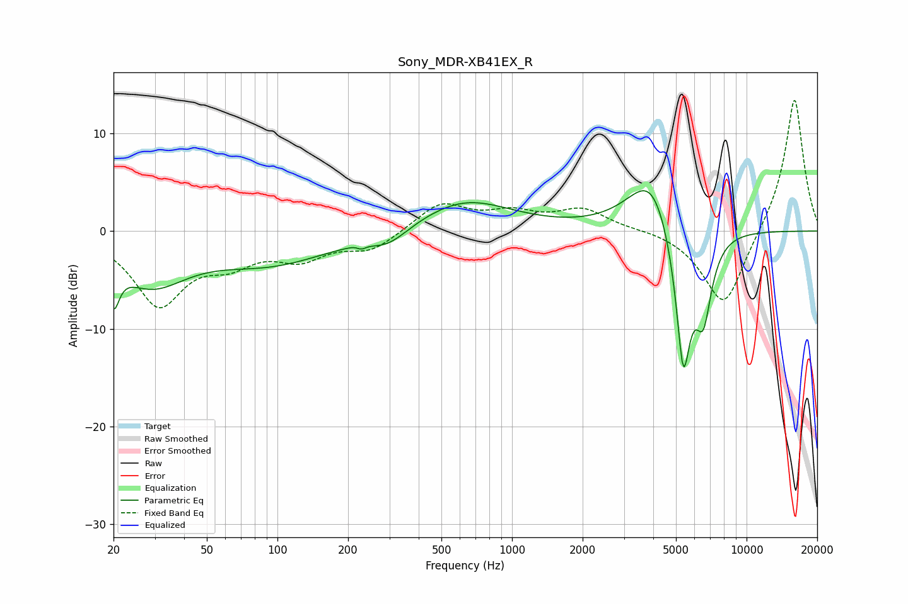

# Sony_MDR-XB41EX_R
See [usage instructions](https://github.com/jaakkopasanen/AutoEq#usage) for more options and info.

### Parametric EQs
Apply preamp of -4.2 dB when using parametric equalizer.

|   # | Type    |   Fc (Hz) |    Q |   Gain (dB) |
|-----|---------|-----------|------|-------------|
|   1 | Peaking |        20 | 5.91 |        -4.2 |
|   2 | Peaking |        29 | 0.93 |        -4.9 |
|   3 | Peaking |        94 | 0.55 |        -3.1 |
|   4 | Peaking |       226 | 5.42 |         2.2 |
|   5 | Peaking |       227 | 5.96 |        -2.4 |
|   6 | Peaking |       296 | 1.61 |        -1.6 |
|   7 | Peaking |       627 | 0.71 |         3.2 |
|   8 | Peaking |      3972 | 1.37 |         6.5 |
|   9 | Peaking |      5373 | 3.81 |       -15.6 |
|  10 | Peaking |      6545 | 3.85 |        -7.5 |

### Fixed Band EQs
When using fixed band (also called graphic) equalizer, apply preamp of **-13.5 dB** (if available) and set gains manually with these parameters.

|   # | Type    |   Fc (Hz) |    Q |   Gain (dB) |
|-----|---------|-----------|------|-------------|
|   1 | Peaking |        31 | 1.41 |        -7.3 |
|   2 | Peaking |        62 | 1.41 |        -2.5 |
|   3 | Peaking |       125 | 1.41 |        -2.4 |
|   4 | Peaking |       250 | 1.41 |        -1.9 |
|   5 | Peaking |       500 | 1.41 |         2.8 |
|   6 | Peaking |      1000 | 1.41 |         1.6 |
|   7 | Peaking |      2000 | 1.41 |         2.1 |
|   8 | Peaking |      4000 | 1.41 |         0.2 |
|   9 | Peaking |      8000 | 1.41 |        -8   |
|  10 | Peaking |     16000 | 1.41 |        13.9 |

### Graphs

