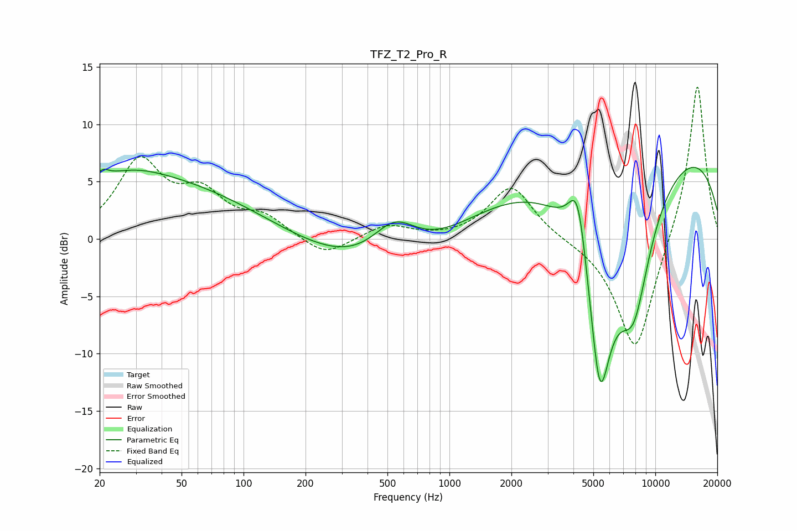

# TFZ_T2_Pro_R
See [usage instructions](https://github.com/jaakkopasanen/AutoEq#usage) for more options and info.

### Parametric EQs
Apply preamp of -6.3 dB when using parametric equalizer.

|   # | Type    |   Fc (Hz) |    Q |   Gain (dB) |
|-----|---------|-----------|------|-------------|
|   1 | Peaking |        20 | 4.33 |         1   |
|   2 | Peaking |        25 | 0.66 |         3.4 |
|   3 | Peaking |        90 | 0.31 |         5.6 |
|   4 | Peaking |       313 | 0.27 |        -5.2 |
|   5 | Peaking |       541 | 1.27 |         3.5 |
|   6 | Peaking |      4208 | 3    |         6.4 |
|   7 | Peaking |      5376 | 2.06 |       -16.4 |
|   8 | Peaking |      6420 | 0.39 |        -7.3 |
|   9 | Peaking |      7534 | 0.19 |        12.9 |
|  10 | Peaking |      7844 | 1.61 |        -9   |

### Fixed Band EQs
When using fixed band (also called graphic) equalizer, apply preamp of **-13.4 dB** (if available) and set gains manually with these parameters.

|   # | Type    |   Fc (Hz) |    Q |   Gain (dB) |
|-----|---------|-----------|------|-------------|
|   1 | Peaking |        31 | 1.41 |         6.5 |
|   2 | Peaking |        62 | 1.41 |         3.4 |
|   3 | Peaking |       125 | 1.41 |         1.7 |
|   4 | Peaking |       250 | 1.41 |        -1.6 |
|   5 | Peaking |       500 | 1.41 |         1.2 |
|   6 | Peaking |      1000 | 1.41 |        -0   |
|   7 | Peaking |      2000 | 1.41 |         4.7 |
|   8 | Peaking |      4000 | 1.41 |        -0   |
|   9 | Peaking |      8000 | 1.41 |       -10.2 |
|  10 | Peaking |     16000 | 1.41 |        14   |

### Graphs

