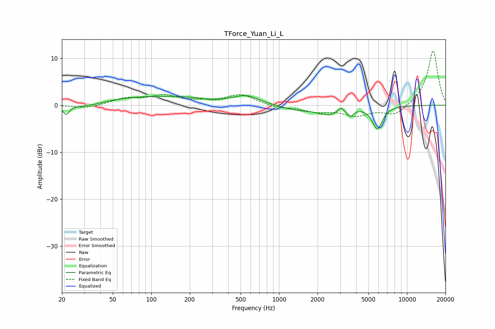

# TForce_Yuan_Li_L
See [usage instructions](https://github.com/jaakkopasanen/AutoEq#usage) for more options and info.

### Parametric EQs
Apply preamp of -2.2 dB when using parametric equalizer.

|   # | Type    |   Fc (Hz) |    Q |   Gain (dB) |
|-----|---------|-----------|------|-------------|
|   1 | Peaking |        22 | 5.99 |        -2   |
|   2 | Peaking |        31 | 0.93 |        -1.4 |
|   3 | Peaking |        99 | 0.24 |         2   |
|   4 | Peaking |       303 | 1.85 |        -0.5 |
|   5 | Peaking |       556 | 1.58 |         1.5 |
|   6 | Peaking |      1360 | 1.14 |        -1   |
|   7 | Peaking |      2461 | 1.56 |        -1.8 |
|   8 | Peaking |      3027 | 5.72 |         1   |
|   9 | Peaking |      3625 | 5.99 |        -1.5 |
|  10 | Peaking |      5860 | 3.46 |        -4.8 |

### Fixed Band EQs
When using fixed band (also called graphic) equalizer, apply preamp of **-11.6 dB** (if available) and set gains manually with these parameters.

|   # | Type    |   Fc (Hz) |    Q |   Gain (dB) |
|-----|---------|-----------|------|-------------|
|   1 | Peaking |        31 | 1.41 |        -0.7 |
|   2 | Peaking |        62 | 1.41 |         1.3 |
|   3 | Peaking |       125 | 1.41 |         1.9 |
|   4 | Peaking |       250 | 1.41 |         0.6 |
|   5 | Peaking |       500 | 1.41 |         2.2 |
|   6 | Peaking |      1000 | 1.41 |        -0.6 |
|   7 | Peaking |      2000 | 1.41 |        -1.2 |
|   8 | Peaking |      4000 | 1.41 |        -2   |
|   9 | Peaking |      8000 | 1.41 |        -2.2 |
|  10 | Peaking |     16000 | 1.41 |        11.8 |

### Graphs

