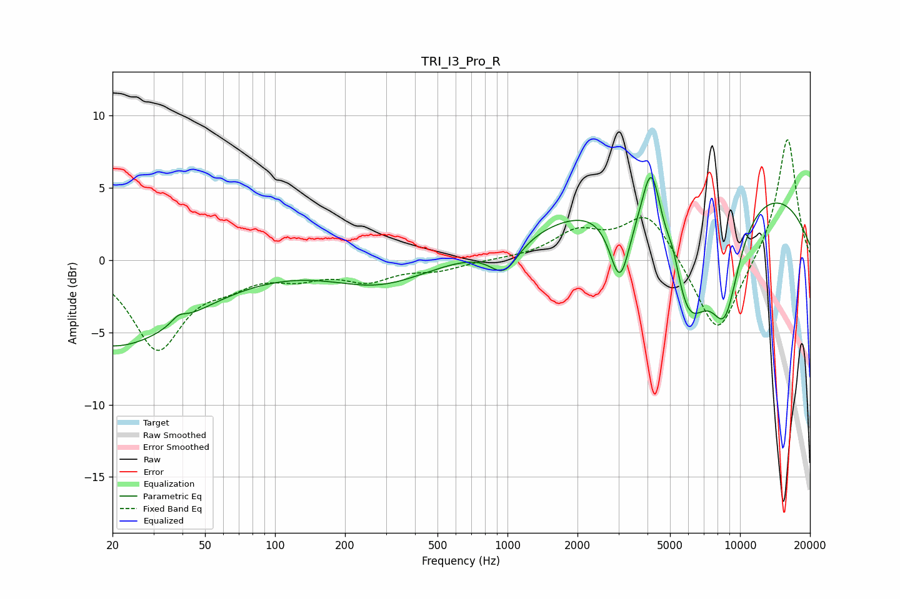

# TRI_I3_Pro_R
See [usage instructions](https://github.com/jaakkopasanen/AutoEq#usage) for more options and info.

### Parametric EQs
Apply preamp of -5.8 dB when using parametric equalizer.

|   # | Type    |   Fc (Hz) |    Q |   Gain (dB) |
|-----|---------|-----------|------|-------------|
|   1 | Peaking |        20 | 0.43 |        -5.9 |
|   2 | Peaking |        39 | 4.61 |         0.5 |
|   3 | Peaking |       281 | 0.69 |        -1.7 |
|   4 | Peaking |       968 | 2.26 |        -2.1 |
|   5 | Peaking |      3044 | 3.2  |        -4.9 |
|   6 | Peaking |      4163 | 3.43 |         5.2 |
|   7 | Peaking |      5167 | 4.51 |         1.7 |
|   8 | Peaking |      5952 | 1.36 |        -8.5 |
|   9 | Peaking |      7248 | 0.18 |         6   |
|  10 | Peaking |      8618 | 1.96 |        -6.5 |

### Fixed Band EQs
When using fixed band (also called graphic) equalizer, apply preamp of **-8.4 dB** (if available) and set gains manually with these parameters.

|   # | Type    |   Fc (Hz) |    Q |   Gain (dB) |
|-----|---------|-----------|------|-------------|
|   1 | Peaking |        31 | 1.41 |        -6   |
|   2 | Peaking |        62 | 1.41 |        -1.1 |
|   3 | Peaking |       125 | 1.41 |        -0.9 |
|   4 | Peaking |       250 | 1.41 |        -1.3 |
|   5 | Peaking |       500 | 1.41 |        -0.6 |
|   6 | Peaking |      1000 | 1.41 |         0   |
|   7 | Peaking |      2000 | 1.41 |         1.8 |
|   8 | Peaking |      4000 | 1.41 |         3.3 |
|   9 | Peaking |      8000 | 1.41 |        -5.5 |
|  10 | Peaking |     16000 | 1.41 |         8.6 |

### Graphs

