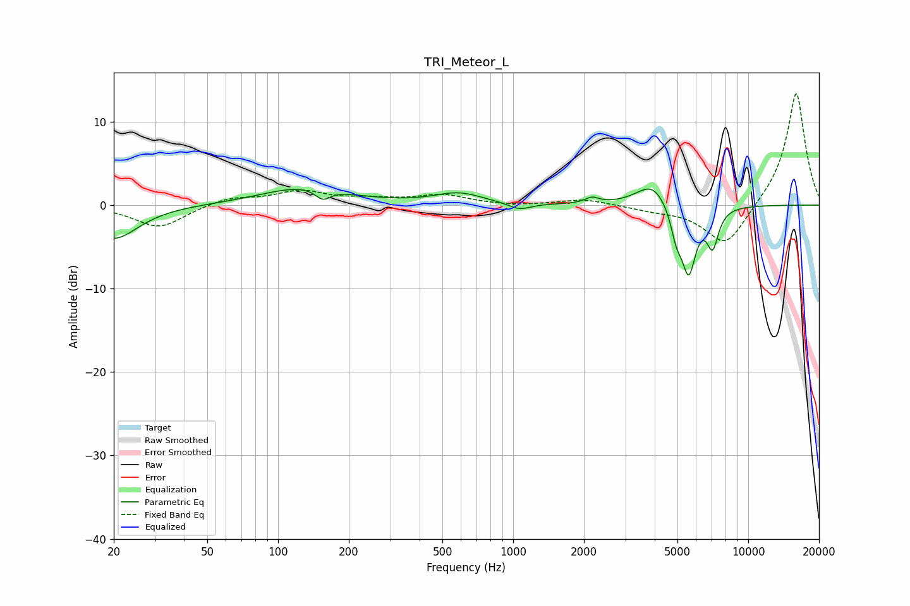

# TRI_Meteor_L
See [usage instructions](https://github.com/jaakkopasanen/AutoEq#usage) for more options and info.

### Parametric EQs
Apply preamp of -2.0 dB when using parametric equalizer.

|   # | Type    |   Fc (Hz) |    Q |   Gain (dB) |
|-----|---------|-----------|------|-------------|
|   1 | Peaking |        20 | 1.37 |        -4.1 |
|   2 | Peaking |       129 | 0.8  |         2.1 |
|   3 | Peaking |       155 | 4.33 |        -1.3 |
|   4 | Peaking |       586 | 1.37 |         1.3 |
|   5 | Peaking |      1063 | 2.94 |        -0.8 |
|   6 | Peaking |      2164 | 4.85 |         0.7 |
|   7 | Peaking |      3910 | 2.07 |         2.8 |
|   8 | Peaking |      4945 | 5.89 |        -2.9 |
|   9 | Peaking |      5582 | 4.45 |        -7.9 |
|  10 | Peaking |      7058 | 5.47 |        -4.4 |

### Fixed Band EQs
When using fixed band (also called graphic) equalizer, apply preamp of **-13.5 dB** (if available) and set gains manually with these parameters.

|   # | Type    |   Fc (Hz) |    Q |   Gain (dB) |
|-----|---------|-----------|------|-------------|
|   1 | Peaking |        31 | 1.41 |        -2.7 |
|   2 | Peaking |        62 | 1.41 |         0.9 |
|   3 | Peaking |       125 | 1.41 |         1.6 |
|   4 | Peaking |       250 | 1.41 |         0.6 |
|   5 | Peaking |       500 | 1.41 |         1.1 |
|   6 | Peaking |      1000 | 1.41 |        -0.2 |
|   7 | Peaking |      2000 | 1.41 |         0.7 |
|   8 | Peaking |      4000 | 1.41 |        -0.5 |
|   9 | Peaking |      8000 | 1.41 |        -5.1 |
|  10 | Peaking |     16000 | 1.41 |        13.7 |

### Graphs

