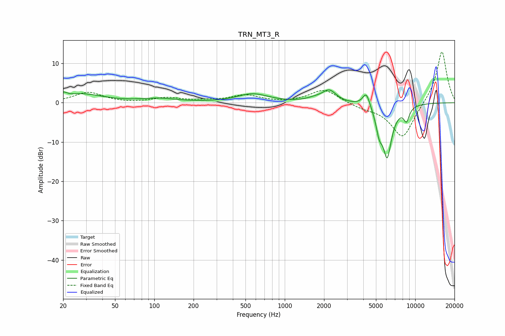

# TRN_MT3_R
See [usage instructions](https://github.com/jaakkopasanen/AutoEq#usage) for more options and info.

### Parametric EQs
Apply preamp of -3.3 dB when using parametric equalizer.

|   # | Type    |   Fc (Hz) |    Q |   Gain (dB) |
|-----|---------|-----------|------|-------------|
|   1 | Peaking |        20 | 5.01 |         1.1 |
|   2 | Peaking |        28 | 0.9  |         2.1 |
|   3 | Peaking |       109 | 1.06 |         0.9 |
|   4 | Peaking |       569 | 1.2  |         2.2 |
|   5 | Peaking |      1702 | 2.14 |         0.7 |
|   6 | Peaking |      2195 | 2.69 |         3   |
|   7 | Peaking |      4218 | 4.93 |         3.8 |
|   8 | Peaking |      5296 | 5.74 |        -4.5 |
|   9 | Peaking |      6098 | 3.73 |       -13.2 |
|  10 | Peaking |      8570 | 6    |        -3.4 |

### Fixed Band EQs
When using fixed band (also called graphic) equalizer, apply preamp of **-13.0 dB** (if available) and set gains manually with these parameters.

|   # | Type    |   Fc (Hz) |    Q |   Gain (dB) |
|-----|---------|-----------|------|-------------|
|   1 | Peaking |        31 | 1.41 |         2.6 |
|   2 | Peaking |        62 | 1.41 |        -0.1 |
|   3 | Peaking |       125 | 1.41 |         1.2 |
|   4 | Peaking |       250 | 1.41 |         0.4 |
|   5 | Peaking |       500 | 1.41 |         1.8 |
|   6 | Peaking |      1000 | 1.41 |        -0.1 |
|   7 | Peaking |      2000 | 1.41 |         3.5 |
|   8 | Peaking |      4000 | 1.41 |        -1   |
|   9 | Peaking |      8000 | 1.41 |        -9.3 |
|  10 | Peaking |     16000 | 1.41 |        13.5 |

### Graphs

