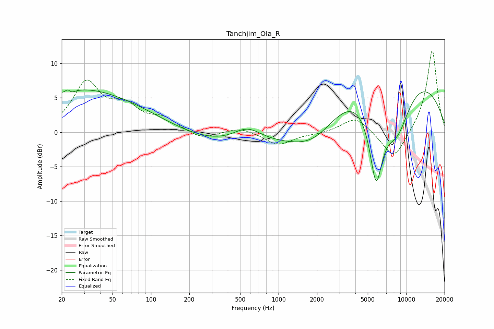

# Tanchjim_Ola_R
See [usage instructions](https://github.com/jaakkopasanen/AutoEq#usage) for more options and info.

### Parametric EQs
Apply preamp of -6.2 dB when using parametric equalizer.

|   # | Type    |   Fc (Hz) |    Q |   Gain (dB) |
|-----|---------|-----------|------|-------------|
|   1 | Peaking |        22 | 5.76 |         3.1 |
|   2 | Peaking |        23 | 4.96 |        -3   |
|   3 | Peaking |        24 | 0.37 |         5.5 |
|   4 | Peaking |        89 | 0.41 |         2.3 |
|   5 | Peaking |       419 | 0.26 |        -2.4 |
|   6 | Peaking |       569 | 1.24 |         2.3 |
|   7 | Peaking |      1933 | 0.65 |        -5.8 |
|   8 | Peaking |      5808 | 2.33 |       -12.7 |
|   9 | Peaking |      6844 | 0.24 |        11.8 |
|  10 | Peaking |      8441 | 1.07 |        -8.9 |

### Fixed Band EQs
When using fixed band (also called graphic) equalizer, apply preamp of **-11.9 dB** (if available) and set gains manually with these parameters.

|   # | Type    |   Fc (Hz) |    Q |   Gain (dB) |
|-----|---------|-----------|------|-------------|
|   1 | Peaking |        31 | 1.41 |         6.9 |
|   2 | Peaking |        62 | 1.41 |         3.2 |
|   3 | Peaking |       125 | 1.41 |         1.7 |
|   4 | Peaking |       250 | 1.41 |        -1.1 |
|   5 | Peaking |       500 | 1.41 |         0.7 |
|   6 | Peaking |      1000 | 1.41 |        -1.9 |
|   7 | Peaking |      2000 | 1.41 |        -0.2 |
|   8 | Peaking |      4000 | 1.41 |         2.3 |
|   9 | Peaking |      8000 | 1.41 |        -4.2 |
|  10 | Peaking |     16000 | 1.41 |        12.1 |

### Graphs

