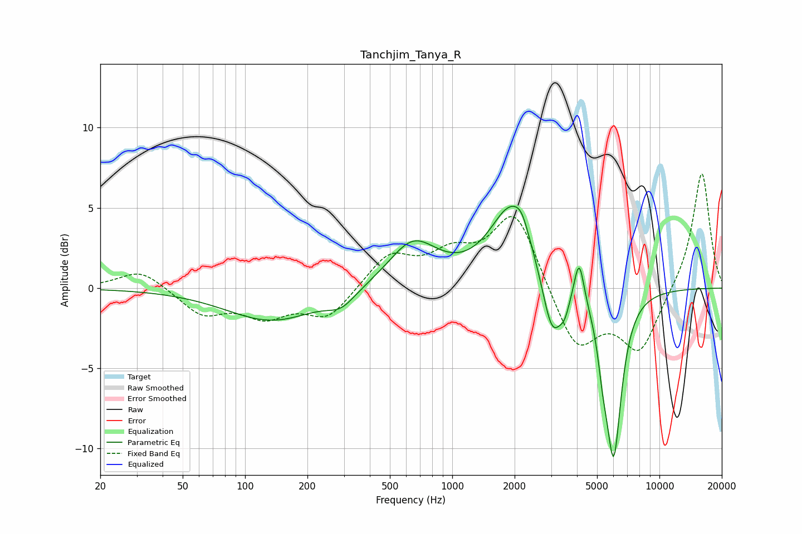

# Tanchjim_Tanya_R
See [usage instructions](https://github.com/jaakkopasanen/AutoEq#usage) for more options and info.

### Parametric EQs
Apply preamp of -5.2 dB when using parametric equalizer.

|   # | Type    |   Fc (Hz) |    Q |   Gain (dB) |
|-----|---------|-----------|------|-------------|
|   1 | Peaking |       135 | 0.64 |        -2   |
|   2 | Peaking |       291 | 2.1  |        -0.9 |
|   3 | Peaking |       646 | 1.2  |         2.8 |
|   4 | Peaking |      1940 | 1.35 |         5.1 |
|   5 | Peaking |      2163 | 4.41 |         0.7 |
|   6 | Peaking |      3037 | 2.9  |        -4   |
|   7 | Peaking |      3486 | 6    |        -0.9 |
|   8 | Peaking |      4097 | 6    |         2.7 |
|   9 | Peaking |      5324 | 6    |        -1.8 |
|  10 | Peaking |      6009 | 3.58 |       -10.3 |

### Fixed Band EQs
When using fixed band (also called graphic) equalizer, apply preamp of **-7.2 dB** (if available) and set gains manually with these parameters.

|   # | Type    |   Fc (Hz) |    Q |   Gain (dB) |
|-----|---------|-----------|------|-------------|
|   1 | Peaking |        31 | 1.41 |         1.2 |
|   2 | Peaking |        62 | 1.41 |        -1.6 |
|   3 | Peaking |       125 | 1.41 |        -1.6 |
|   4 | Peaking |       250 | 1.41 |        -1.8 |
|   5 | Peaking |       500 | 1.41 |         2   |
|   6 | Peaking |      1000 | 1.41 |         1.8 |
|   7 | Peaking |      2000 | 1.41 |         4.8 |
|   8 | Peaking |      4000 | 1.41 |        -3.9 |
|   9 | Peaking |      8000 | 1.41 |        -3.8 |
|  10 | Peaking |     16000 | 1.41 |         7.4 |

### Graphs

